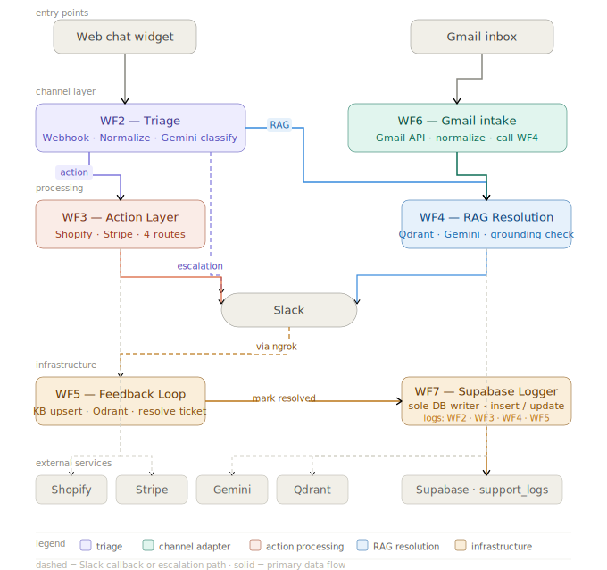

# VoltShop CX Agent

[](https://github.com/ShafqaatMalik/n8n-cx-agent/actions/workflows/ci.yml)
[](https://github.com/ShafqaatMalik/n8n-cx-agent/actions/workflows/cd.yml)

A production-grade AI customer support automation system. Multi-channel intake (chat webhook, Gmail), agentic RAG over a self-healing Qdrant knowledge base, transactional action handling against live Shopify and Stripe sandboxes, human-in-the-loop escalation via Slack, and real-time observability through a Supabase-backed analytics dashboard — deployed on Railway with full CI/CD.

**[Live Demo](https://verdant-kringle-543ae3.netlify.app)** · **[Analytics Dashboard](https://verdant-kringle-543ae3.netlify.app/voltshop_dashboard.html)**

---

## System Overview

VoltShop CX Agent handles the full customer support lifecycle for a fictional electronics retailer. It manages policy queries via RAG, processes order and refund actions against live Shopify/Stripe sandboxes, escalates unresolvable tickets to Slack with human-in-the-loop resolution buttons, and ingests support emails via Gmail. Every ticket is logged to Supabase with structured metadata and surfaced in a real-time observability dashboard.

The architecture is intentionally modular: each workflow owns a single responsibility and communicates via n8n's sub-workflow execution protocol. This makes individual components independently testable and replaceable without touching the rest of the pipeline.

---

## Architecture

```
┌──────────────────────────────────────────────────────────────────────┐
│                         WF2 — Triage                                 │
│                                                                      │
│  Webhook ──┐                                                         │
│            ├──► Normalize Input ──► djb2 Hash ──► Cache Lookup       │
│  Chat  ────┘                                     │                   │
│                                           hit ◄──┘──► miss           │
│                                            │              │           │
│                                     Respond (~800ms)  Gemini         │
│                                     Log cache hit     Classify       │
│                                                            │          │
│                              ┌─────────────┬──────────────┤          │
│                           escalate      action           RAG         │
└──────────────────────────────┼─────────────┼──────────────┼──────────┘
                               │             │              │
                               │             │              │
                    ┌──────────▼──┐  ┌───────▼──────  ┌───▼──────────────┐
                    │Slack alert  │  │  WF3          │  │ WF4              │
                    │Supabase log │  │  Action Layer │  │ RAG Resolution   │
                    │Respond      │  │               │  │                  │
                    └─────────────┘  │ Gemini NER    │  │ Qdrant retrieval │
                                     │ Shopify API   │  │ Confidence parse │
                                     │ Stripe API    │  │ Cache write      │
                                     │               │  │ Grounded → log   │
                                     │ 4 exit paths: │  │ Ungrounded →     │
                                     │ refund_success|  | Slack + log      |
                                     │ refund_pending│  └──────────────────┘
                                     │ no_match      │
                                     │ order_not_fnd │
                                     └───────────────┘

  Gmail ──► WF6 (poll, 1min) ──► filter self-replies ──► WF4 ──► reply

  Slack button ──► WF5 ──► mark_resolved  → Supabase update
                       └──► resolve_add_kb → Qdrant upsert + Supabase update

  All paths ──► WF7 (log-ticket webhook) ──► Supabase support_logs
                 retry: 3 attempts, 1s wait
```



---

## Stack

| Layer | Technology |
|---|---|
| Workflow orchestration | n8n (self-hosted, Railway) |
| LLM | Google Gemini 2.5 Flash |
| Vector store | Qdrant Cloud (Frankfurt, GCP) |
| Embeddings | Gemini Embedding 001 (3072 dims) |
| Database | Supabase (Postgres) |
| Messaging | Slack (interactive buttons) |
| Email | Gmail (OAuth2, poll trigger) |
| Commerce | Shopify Admin API, Stripe API |
| Frontend | Vanilla HTML/CSS/JS — Netlify |
| CI/CD | GitHub Actions |
| Deployment | Railway (n8n), Netlify (frontend) |

---

## Technology Choices and Rationale

| Component | Choice | Rationale |
|---|---|---|
| Orchestration | n8n | Visual debuggability, native sub-workflow protocol, credential isolation per node. LangGraph considered but adds Python complexity without benefit for a workflow-first system. |
| LLM | Gemini 2.5 Flash | Low latency, strong instruction following, generous free tier RPM for development. GPT-4o considered but cost-prohibitive at load test volumes. |
| Vector store | Qdrant Cloud | Cosine similarity, payload filtering, free managed tier with 3072-dim support. Pinecone considered but Qdrant's self-hostability is a production migration path. |
| Embeddings | Gemini Embedding 001 | 3072 dimensions, same provider as LLM, no additional credential. OpenAI embeddings considered but cross-provider dependency adds failure surface. |
| Database | Supabase (Postgres) | Structured logging, RLS, REST API without ORM overhead. Native Postgres means no migration risk if moving off Supabase. |
| Cache hash | djb2 | O(n) string hash, no crypto module dependency in n8n Code node, deterministic collision resistance sufficient for query-length strings. MD5 considered but requires Node crypto which has n8n version inconsistencies. |
| Deployment | Railway | Persistent containers, native WebSocket support for n8n UI. Cloud Run rejected — incompatible with n8n's WebSocket/SSE origin checks behind GCP proxy. |
| Frontend | Vanilla HTML/CSS/JS | No build pipeline, no framework dependency, instant Netlify deploy. React considered but adds unnecessary complexity for a static demo storefront. |
| CI/CD | GitHub Actions | n8n's native Git integration requires an Enterprise plugin unavailable on Railway free tier. REST API push via Actions is portable and plugin-free. |
| Cache operations | Native Supabase node | HTTP Request node for Supabase PATCH/INSERT silently fails without error output in n8n — native Supabase node handles auth and operations correctly with visible output. |

---

## Data Model

### `support_logs` — primary ticket store

```sql
id              uuid        PRIMARY KEY DEFAULT gen_random_uuid()
created_at      timestamptz DEFAULT now()
ticket_id       text        -- epoch ms timestamp, unique per request
channel         text        -- 'chat' | 'email'
customer_id     text        -- sessionId (chat) or sender email (Gmail)
message         text        -- raw customer message
intent          text        -- classified intent from WF2 Gemini agent
confidence      integer     -- 1-5, from WF4 RAG confidence parsing
rag_answer      text        -- final response sent to customer
grounded        boolean     -- true if answer supported by KB retrieval
escalated       boolean     -- true if routed to Slack for human review
resolved        boolean     -- updated by WF5 Slack button callbacks
resolution_note text        -- populated on Resolve + Add to KB
response_ms     integer     -- end-to-end latency from ticket_id timestamp
source          text        -- 'wf2' (cache) | 'wf3' (action) | 'wf4' (RAG)
route           text        -- granular route: cache_hit | refund_success | refund_pending | no_match | order_not_found | confident | escalated
```

### `response_cache` — query-level cache

```sql
id          uuid        PRIMARY KEY
query_hash  text        UNIQUE      -- djb2 hex of normalised query
query_text  text                    -- normalised query for debugging
response    text                    -- cached RAG response
hit_count   integer                 -- incremented on each cache hit
created_at  timestamptz
expires_at  timestamptz             -- TTL: set to 2027-01-01
updated_at  timestamptz             -- updated on each cache hit
```

RLS is enabled on both tables with permissive policies. The anon key is used for dashboard reads; the service role key is used for n8n writes.

---

## Workflows

### WF2 — Triage

Entry point for all chat-channel traffic (Webhook + Chat Trigger). Normalises input, computes a djb2 hash for cache lookup, checks Supabase `response_cache` with an expiry filter, cache hit responds immediately and logs asynchronously; cache miss proceeds to Gemini classification and routes to one of three paths: direct escalation, action layer (WF3), or RAG resolution (WF4). Cache hit logging uses real elapsed time from `start_time` rather than a hardcoded value.

### WF3 — Action Layer

Handles intents requiring live data lookup. Gemini extracts `order_id` and `action_type` from the message. A Check Missing Entities gate blocks on missing `order_id` only (email was removed from the gate after observing it caused unnecessary friction on order status queries). Shopify is queried via HTTP Request with `httpMultipleHeadersAuth` (X-Shopify-Access-Token) rather than n8n's native Shopify node — the native node's credential type was incompatible with the Railway deployment and required a workaround via API injection. Four Stripe-backed paths: refund success (auto-process), refund pending (Slack approval), no match (escalate), and order not found (Slack alert). All paths log structured output to WF7.

### WF4 — RAG Resolution

Gemini powered RAG agent with Qdrant as a retrieval tool. AI Agent queries Qdrant `voltshop_kb`, appends `CONFIDENCE: [1-5]` and `GROUNDED: [true/false]` metadata. Parse Confidence Code node extracts both values and passes `queryHash` + `normalizedQuery` through to downstream nodes. Grounded responses write to `response_cache` with upsert semantics (handles the duplicate key constraint that occurs on cache warm-up). Ungrounded responses build a Slack Block Kit payload with Mark Resolved and Resolve + Add to KB interactive buttons carrying the `ticket_id` as the action value. AI Agent prompt instructs Gemini to preserve full KB detail without summarising.

### WF5 — Feedback Loop

Receives Slack interactive action POSTs. Parses `action_id` and `value` (ticket_id) from the payload. Mark Resolved PATCHes `resolved=true` on the matching Supabase row. Resolve + Add to KB additionally upserts the `rag_answer` as a new Qdrant point, incrementing the KB without a manual ingest cycle. This is the self-healing mechanism — production escalations directly improve future RAG quality.

### WF6 — Gmail Intake

Polls Gmail every minute for unread messages labelled `voltshop-support`. A Filter Sender node drops self-replies (n8n's reply-to-self loop) by checking the From address against the system account. Normalised email body is passed to WF4 (RAG) as `chatInput`; the Gmail reply uses the WF4 output directly. Logs with `channel=email` for dashboard channel breakdown.

### WF7 — Supabase Logger

Stateless logging endpoint exposed as a webhook (`/webhook/log-ticket`). All upstream workflows POST structured JSON; WF7 upserts to `support_logs`. Retry on fail (3 attempts, 1s wait) handles the Supabase free tier connection pool ceiling under concurrent load. The `onError: continueRegularOutput` flag prevents logging failures from breaking the customer-facing response path.

---

## Observability

The Supabase `support_logs` table is the system's primary observability surface. Every ticket — regardless of channel, route, or outcome — produces a row. The analytics dashboard queries this table directly via the Supabase REST API with offset-based pagination (1000 rows/request) to handle the free tier's default row limit.

**Metrics available from the table:**

- Auto-resolve rate (`escalated=false AND grounded=true`)
- Grounding rate (`grounded=true`)
- Escalation rate (`escalated=true`)
- Escalation resolution rate (`resolved=true WHERE escalated=true`)
- Response time distribution (p50, p95 from `response_ms`)
- Channel breakdown (`channel`)
- Route breakdown (`route`)
- Ticket volume over time (`created_at`)
- Cache hit rate (`source=wf2`)

**Dashboard p95 caveat:** The dashboard p95 (4.0s) is calculated from logged tickets only. WF3 route tickets (Shopify + Stripe pipeline, 6-11s end-to-end) are disproportionately lost to Supabase write failures under concurrent load and are underrepresented. The load test p95 of 7.2s is the accurate system-level figure.

---

## Performance

Load tests were run post-deployment against the live Railway instance with caching enabled and real response time tracking. All tests use async concurrent requests via `asyncio` + `httpx`. Results reflect genuine system behaviour including free-tier constraints.

### Grounded RAG Test — `load_test_grounded.py`

43 KB-grounded questions × 23 repeats = 989 tickets. Measures cache performance and RAG throughput under repeated queries.

```
HTTP success   : 100% (989/989)
Throughput     : 5.9 req/s
Avg latency    : 1,670ms
p50 latency    : 967ms
p95 latency    : 4,728ms
p99 latency    : 5,243ms
Min latency    : 623ms       ← warm cache hits
Max latency    : 6,223ms
Cache hit rate : ~95.6%      ← 946/989 requests served from cache
```

### Mixed Load Test — `load_test_mixed.py`

500 tickets across all intent types at concurrency 20. Most realistic simulation of production traffic distribution.

```
Distribution   : 50% RAG | 15% ungrounded | 15% escalation | 10% order | 10% refund
HTTP success   : 100% (500/500)
Throughput     : 5.9 req/s
Avg latency    : 3,269ms
p50 latency    : 2,599ms
p95 latency    : 7,169ms
p99 latency    : 9,699ms
Min latency    : 777ms
Max latency    : 10,877ms    ← WF3 Shopify + Stripe chain
```

### Live Dashboard — 3,522 tickets across all channels

```
Auto-resolve rate  : 84%
Grounding rate     : 84%
Escalation rate    : 13%
Esc. resolution    : 19%    (via WF5 Slack buttons)
p50 response time  : 1.2s
p95 response time  : 4.0s   (logged tickets only — see known limitations)
```

**Cache performance:** First hit 4-7s (Gemini + Qdrant). Subsequent hits ~700ms-1.2s. ~5-8x latency improvement.

---

## Failure Modes and Degradation

| Failure | Impact | Behaviour |
|---|---|---|
| Gemini API down | WF2 classification fails | WF2 defaults to RAG route; WF4 RAG agent fails; customer receives error response |
| Gemini 429 (rate limit) | Intermittent LLM failures | Request fails; no retry implemented; 0.7% failure rate observed under load |
| Qdrant unavailable | RAG retrieval fails | WF4 agent returns ungrounded response; escalates to Slack |
| Supabase write failure | Ticket not logged | WF7 retries 3×; ticket processed but not logged — silent data loss |
| Shopify API auth failure | WF3 order lookups fail | Entire WF3 execution fails; customer receives error response |
| Railway container restart | Brief downtime | All workflows temporarily unavailable; Railway Hobby tier keeps containers always-on — no idle issue |
| Cache duplicate key | Write Cache skips | Unique constraint on `query_hash` causes upsert conflict — handled by `resolution=merge-duplicates` |
| Slack token expired | Escalation silent failure | Slack nodes return `not_authed`; ticket logged but agent not notified |

---

## Known Limitations

**No session memory**
Each message is stateless. Multi-turn conversations require the customer to provide full context in a single message. Designed fix: `pending_sessions` Supabase table + WF2 pre-check.

**Cache hash is exact-match only**
djb2 hashes normalised query strings. Typos produce different hashes and bypass cache. `"what is your return policy?"` and `"what is you return policy?"` are separate cache entries. Fuzzy/semantic cache matching would require embedding comparison.

**Cache staleness**
KB updates via WF5 take effect immediately for new queries but existing cache entries are not invalidated. No active cache invalidation is implemented.

**Gmail snippet only**
WF6 processes Gmail snippet (~100 chars) rather than full MIME body. Sufficient for short queries; may miss context in long emails.

**No WF7 authentication**
WF7's `log-ticket` webhook endpoint has no authentication. Any POST to the URL will be processed. Mitigated by Railway's network layer in production.

**Supabase connection pool exhaustion**
Free tier Postgres has a connection pool ceiling. At sustained concurrency >15, write failures occur silently. WF7 retries 3× but pool exhaustion can cause all retries to fail.

**n8n HTTP Request node silently fails on Supabase PATCH/INSERT**
HTTP Request nodes configured to POST/PATCH Supabase REST API return empty output with no error when the operation fails (RLS violation, malformed body, auth issue). Native Supabase nodes expose errors correctly. All cache operations (Write Cache, Increment Hit Count) use native Supabase nodes as a result.

---

## Repository Structure

```
n8n-cx-agent/
├── workflows/                       # n8n workflow JSONs (WF2–WF7)
│   ├── WF2_Triage.json
│   ├── WF3_Action_Layer.json
│   ├── WF4_RAG_Resolution.json
│   ├── WF5_Feedback_Loop.json
│   ├── WF6_Gmail_Intake.json
│   └── WF7_Supabase_Logger.json
├── knowledge-base/                  # FAQ markdown files → Qdrant chunks
│   ├── account-billing-faq.md
│   ├── product-catalog-faq.md
│   ├── return-policy.md
│   ├── shipping-policy.md
│   ├── technical-support-faq.md
│   └── warranty-policy.md
├── scripts/
│   ├── ingest_knowledge_base.py     # Embed and upsert KB into Qdrant Cloud
│   ├── load_test_grounded.py        # 989-ticket grounded RAG load test
│   └── load_test_mixed.py           # 500-ticket mixed realistic load test
├── dashboard/
│   ├── index.html                   # VoltShop storefront + VoltBot chat widget
│   └── voltshop_dashboard.html      # Real-time analytics dashboard
├── docs/
│   ├── voltshop_architecture.md
│   ├── voltshop_architecture.svg
│   └── WF2_Triage.md – WF7_Supabase_Logger.md
├── load_test_grounded_results.json  # 989-ticket grounded load test results
├── load_test_mixed_results.json     # 500-ticket mixed load test results
├── docker-compose.yml               # Local n8n development setup
├── requirements.txt
└── .github/workflows/
    ├── ci.yml                       # Validate workflow JSONs + required files
    └── cd.yml                       # Deploy workflows to Railway n8n via REST API
```

---

## Local Setup

```bash
git clone https://github.com/ShafqaatMalik/n8n-cx-agent
cd n8n-cx-agent
cp .env.example .env
# Edit .env — required: QDRANT_HOST, QDRANT_API_KEY, GEMINI_API_KEY

python -m venv venv && source venv/bin/activate  # Windows: venv\Scripts\activate
pip install -r requirements.txt

docker compose up -d  # starts n8n on localhost:5678 with Postgres backing
```

**Credential setup order matters:**

1. Create Qdrant, Supabase, Gemini, Slack, Gmail, Shopify, Stripe credentials in n8n first
2. Import workflow JSONs from `workflows/`
3. Re-link credentials in each workflow (IDs differ between instances)
4. Run KB ingest before activating WF4

```bash
python scripts/ingest_knowledge_base.py
```

**WF7 must be activated before any other workflow** — it is the logging dependency for WF2, WF3, and WF4.

---

## Production Deployment

n8n runs on Railway using the official n8n + Postgres template (persistent container, native WebSocket). Cloud Run was evaluated and rejected — n8n's WebSocket/SSE origin check is incompatible with GCP's managed proxy layer, causing permanent UI offline state.

Qdrant runs on Qdrant Cloud free tier (Frankfurt, GCP, cosine distance, 3072-dim vectors).

Frontend is deployed to Netlify. The VoltBot widget POSTs to the Railway webhook URL. The analytics dashboard queries Supabase directly from the browser using the anon key.

**Railway environment variables:**

- `N8N_ENCRYPTION_KEY` — must match the key used when credentials were created
- `DB_TYPE=postgresdb` + `DB_POSTGRESDB_*` connection vars
- All service API keys managed via n8n credential store, not environment variables

---

## Author

**Shafqaat Malik**
[LinkedIn](https://linkedin.com/in/shafqaatmalik)
