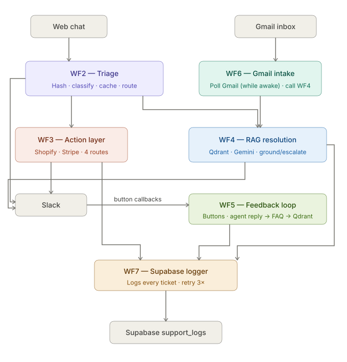

# VoltShop CX Agent

[](https://github.com/ShafqaatMalik/n8n-cx-agent/actions/workflows/ci.yml)
[](https://github.com/ShafqaatMalik/n8n-cx-agent/actions/workflows/cd.yml)

A production-grade AI customer support automation system. Multi-channel intake (chat webhook, Gmail), agentic RAG over a self-healing Qdrant knowledge base, transactional action handling against live Shopify and Stripe sandboxes, human-in-the-loop escalation via Slack, and real-time observability through a Supabase-backed analytics dashboard — running on Google Cloud Run (scale to zero, free tier) with full CI/CD.

**[Live Demo](https://verdant-kringle-543ae3.netlify.app)** · **[Analytics Dashboard](https://verdant-kringle-543ae3.netlify.app/voltshop_dashboard.html)** · **[Demo Video](https://github.com/ShafqaatMalik/n8n-cx-agent/releases/download/v1.0/VoltShop_Demo_Final.mp4)**

Demo system on scale-to-zero hosting: the first message after idle takes ~20 s while the agent wakes up.

## Contents

- [System Overview](#system-overview)
- [Architecture](#architecture)
- [Stack](#stack)
- [Workflows](#workflows)
- [Production Deployment](#production-deployment)
- [CI/CD](#cicd)
- [Observability](#observability)
- [Performance](#performance)
- [Failure Modes and Degradation](#failure-modes-and-degradation)
- [Known Limitations](#known-limitations)
- [Technology Choices and Rationale](#technology-choices-and-rationale)
- [Why Cloud Run works now](#why-cloud-run-works-now)
- [Data Model](#data-model)
- [Repository Structure](#repository-structure)
- [Local Setup](#local-setup)
- [Demo warm-up](#demo-warm-up)

---

## System Overview

VoltShop CX Agent handles the full customer support lifecycle. It manages policy queries via RAG, processes order and refund actions against live Shopify/Stripe sandboxes, escalates unresolvable tickets to Slack with human-in-the-loop resolution buttons, and ingests support emails via Gmail. Every ticket is logged to Supabase with structured metadata and surfaced in a real-time observability dashboard.

The architecture is intentionally modular: each workflow owns a single responsibility and communicates via n8n's sub-workflow execution protocol. This makes individual components independently testable and replaceable without touching the rest of the pipeline.

---

## Architecture

```
┌──────────────────────────────────────────────────────────────────────┐
│                         WF2 — Triage                                 │
│                                                                      │
│  Webhook ──┐                                                         │
│            ├──► Normalize Input ──► djb2 Hash ──► Cache Lookup       │
│  Chat  ────┘                                     │                   │
│                                           hit ◄──┘──► miss           │
│                                            │              │           │
│                                     Respond (~800ms)  Gemini         │
│                                     Log cache hit     Classify       │
│                                                            │          │
│                              ┌─────────────┬──────────────┤          │
│                           escalate      action           RAG         │
└──────────────────────────────┼─────────────┼──────────────┼──────────┘
                               │             │              │
                               │             │              │
                    ┌──────────▼──┐  ┌───────▼───────┐  ┌───▼──────────────┐
                    │Slack alert  │  │  WF3          │  │ WF4              │
                    │Supabase log │  │  Action Layer │  │ RAG Resolution   │
                    │Respond      │  │               │  │                  │
                    └─────────────┘  │ Gemini NER    │  │ Qdrant retrieval │
                                     │ Shopify API   │  │ Confidence parse │
                                     │ Stripe API    │  │ Cache write      │
                                     │               │  │ Grounded → log   │
                                     │ 4 exit paths: │  │ Ungrounded →     │
                                     │ refund_success│  │ Slack + log      │
                                     │ refund_pending│  └──────────────────┘
                                     │ no_match      │
                                     │ order_not_fnd │
                                     └───────────────┘

  Gmail ──► WF6 (poll, 1min) ──► filter self-replies ──► WF4 ──► reply

  Slack button ──► WF5 ──► mark_resolved  → WF7: resolved=true
                       └──► resolve_add_kb → agent's Slack thread reply → Gemini FAQ entry
                                             → embed + insert into Qdrant → WF7: resolved + resolution_note

  All paths ──► WF7 (log-ticket webhook) ──► Supabase support_logs
                 retry: 3 attempts, 1s wait
```



---

## Stack

| Layer | Technology |
|---|---|
| Workflow orchestration | n8n 2.17.7 (official image, pinned) on Google Cloud Run — Tokyo (`asia-northeast1`) |
| n8n's own database | Supabase Postgres (Tokyo), separate `n8n` schema, via the session pooler |
| LLM | Google Gemini `gemini-flash-lite-latest`, temperature 0 (free-tier API key) |
| Vector store | Qdrant Cloud free tier (Frankfurt, GCP) |
| Embeddings | Gemini Embedding 001 (3072 dims) |
| Ticket store | Supabase (Postgres) — `support_logs`, `response_cache` |
| Messaging | Slack (interactive buttons) |
| Email | Gmail (OAuth2, poll trigger) |
| Commerce | Shopify Admin API, Stripe API (sandboxes) |
| Frontend | Vanilla HTML/CSS/JS — Netlify, deployed from GitHub |
| Secrets | n8n credential store (service keys), Google Secret Manager (deploy secrets), GitHub Secrets (CI/CD) |
| CI/CD | GitHub Actions — CI, CD to Cloud Run (Workload Identity Federation), keep-alive |

---

## Workflows

### WF2 — Triage

Entry point for all chat-channel traffic (Webhook + Chat Trigger). Normalises input, computes a djb2 hash for cache lookup, checks Supabase `response_cache` with an expiry filter, cache hit responds immediately and logs asynchronously; cache miss proceeds to Gemini classification and routes to one of three paths: direct escalation, action layer (WF3), or RAG resolution (WF4). Cache hit logging uses real elapsed time from `start_time` rather than a hardcoded value.

### WF3 — Action Layer

Handles intents requiring live data lookup. Gemini extracts `order_id` and `action_type` from the message. A Check Missing Entities gate blocks on missing `order_id` only (email was removed from the gate after observing it caused unnecessary friction on order status queries). Shopify is queried via HTTP Request with `httpMultipleHeadersAuth` (X-Shopify-Access-Token) rather than n8n's native Shopify node, whose credential type did not work in this setup; a plain access-token header does. Four exit paths: refund success (auto-process), refund pending (Slack approval), no match (escalate), and order not found (Slack alert). All paths log structured output to WF7.

### WF4 — RAG Resolution

Gemini powered RAG agent with Qdrant as a retrieval tool. AI Agent queries Qdrant `voltshop_kb`, appends `CONFIDENCE: [1-5]` and `GROUNDED: [true/false]` metadata. Parse Confidence Code node extracts both values and passes `queryHash` + `normalizedQuery` through to downstream nodes. Grounded responses are written to `response_cache` with a plain insert (native Supabase node), expiring one year after the write. If the `query_hash` already exists — for example two identical questions at the same moment — the insert fails on the unique constraint, but Write Cache is set to On Error → Continue, so the customer's answer and the WF7 log call are unaffected. Expired rows are deleted nightly by a Supabase `pg_cron` job, so an expired entry never blocks a fresh write. Ungrounded responses build a Slack Block Kit payload with Mark Resolved and Resolve + Add to KB interactive buttons carrying the `ticket_id` as the action value. AI Agent prompt instructs Gemini to preserve full KB detail without summarising.

### WF5 — Feedback Loop

Receives Slack interactive action POSTs. Parses `action_id` and `value` (ticket_id) from the payload. **Mark Resolved** sends an update to WF7, which sets `resolved=true` on the matching row. **Resolve + Add to KB** fetches the human agent's reply in the Slack thread (`conversations.replies`), has Gemini turn the customer question and that reply into an FAQ entry (full detail, not summarised), embeds it with Gemini Embedding 001 and inserts it into Qdrant as a new point; WF7 then marks the ticket resolved with the agent's reply as `resolution_note`. This grows the KB without a manual ingest cycle. This is the self-healing mechanism — production escalations directly improve future RAG quality.

### WF6 — Gmail Intake

Polls Gmail every minute for messages labelled `voltshop-support` — only while the Cloud Run service is awake (see Known Limitations). A Filter Sender node drops self-replies (n8n's reply-to-self loop) by checking the From address against the system account. The email snippet is passed to WF4 (RAG) as `chatInput` and `raw_message`, with `intent: general`, so email tickets log the customer's message like chat tickets do; the Gmail reply uses the WF4 output directly. Logs with `channel=email` for dashboard channel breakdown. The poller's state (last check time, recently answered message IDs) is stored in the database, so restarts and cold starts do not re-answer old emails.

### WF7 — Supabase Logger

Stateless logging endpoint exposed as a webhook (`/webhook/log-ticket`). All upstream workflows POST structured JSON; WF7 upserts to `support_logs`. Retry on fail (3 attempts, 1s wait) handles the Supabase free tier connection pool ceiling under concurrent load. The `onError: continueRegularOutput` flag prevents logging failures from breaking the customer-facing response path.

---

## Production Deployment

```
Browser ──► Netlify (storefront + dashboard, deployed from GitHub main)
   │                 └──► Supabase REST (anon key, read-only on support_logs)
   ▼
Cloud Run "n8n" (Tokyo, 1 instance max, scales to zero)
   ├──► Supabase Postgres, schema n8n  (session pooler, TLS verified with Supabase's CA)
   ├──► Supabase REST (service role, via n8n credential)
   ├──► Qdrant Cloud (Frankfurt) · Gemini API · Shopify · Stripe · Slack · Gmail
   ▲
Slack buttons · Gmail poll (while awake) · VoltBot webhook
```

**Cloud Run service** — defined in `infra/cloudrun/service.yaml` and deployed with `gcloud run services replace` (by CD):

| Setting | Value |
|---|---|
| Image | `docker.io/n8nio/n8n:2.17.7` (pinned; pulled straight from Docker Hub) |
| Region | `asia-northeast1` (Tokyo) — next to the Supabase database, which n8n queries on every execution |
| Scaling | min 0, **max 1** — a second instance would run the Gmail poller twice |
| Billing | instance-based (CPU always allocated while running), 1 vCPU, 2 GiB |
| Timeout / affinity / startup boost | 3600 s / on / on |
| Health endpoint | `/health` (`N8N_ENDPOINT_HEALTH=health`) |
| Execution pruning | keep 7 days, max 5,000 executions — keeps n8n well under Supabase's 500 MB |
| Telemetry | diagnostics and version notifications off |

**n8n's database:** the existing Supabase project, schema `n8n`, role `n8n_app` — it owns the `n8n` schema and has no access to `support_logs` or `response_cache`. It connects through Supabase's **session pooler** on port 5432, which is IPv4 — the direct connection is IPv6-only, and the transaction pooler breaks n8n's migrations. TLS is verified against Supabase's root CA, mounted from Secret Manager (`DB_POSTGRESDB_SSL_CA_FILE`; n8n only reads the CA from a file through the `_FILE` suffix).

**Secrets:** Secret Manager holds the n8n encryption key, the database password, the Supabase CA certificate and the n8n API key; Cloud Run's runtime service account can read only the first three. Service API keys (Gemini, Qdrant, Supabase, Shopify, Stripe, Slack, Gmail) live in n8n's encrypted credential store — no workflow node contains a token.

**Workflows** were imported with their original IDs (`n8n import:workflow`), so sub-workflow calls and CD mappings did not change. Credentials were re-created in the n8n UI.

**Frontend:** Netlify deploys the `dashboard/` folder from GitHub `main` on every push (no build step; `netlify.toml` sets `base = "dashboard"` so Netlify never installs Python dependencies). VoltBot calls the Cloud Run webhook. The analytics dashboard reads `support_logs` directly with the Supabase anon key, which is public by design and limited by RLS to reading that one table.

---

## CI/CD

| Workflow | Trigger | What it does |
|---|---|---|
| **CI** (`ci.yml`) | every push and PR to `main` | Python 3.14; validates the workflow JSONs; checks required files; `flake8 scripts/`; runs `scripts/ci_guard.py`, which fails on secrets or redaction leftovers, old hosting URLs, fake credential IDs, or a Cloud Run config with more than one instance, CPU throttling, or an unpinned image |
| **CD** (`cd.yml`) | push to `main` touching `workflows/` or `infra/cloudrun/`; or manual | Redeploys the Cloud Run service only if `infra/cloudrun/` changed, then updates only the workflow files that changed |
| **Keep-alive** (`keepalive.yml`) | Mon + Thu 06:17 UTC; or manual | Reads one Supabase row and the Qdrant collection; never touches n8n or Slack |

**How CD updates a workflow** (`scripts/deploy_workflows.py`): it waits out a cold start, targets the workflow by the `id` in its JSON (it never creates workflows), keeps the live credentials node by node, sends the Gmail poller state back unchanged, skips workflows that already match, re-publishes only workflows that were already active, and never activates or deactivates anything. It then reads the workflow back and fails the run if the active state, credentials or poller state changed. A manual run can check all workflows, redeploy the service, or do a dry run.

**Authentication:** GitHub logs in to Google Cloud through **Workload Identity Federation** — no service-account key exists. Only runs from `main` of this repository are accepted, and the deployer account can update the `n8n` Cloud Run service and nothing else. The n8n API key is a GitHub secret.

---

## Observability

The Supabase `support_logs` table is the system's primary observability surface. Every ticket — regardless of channel, route, or outcome — produces a row. The analytics dashboard queries this table directly via the Supabase REST API with offset-based pagination (1000 rows/request) to handle the free tier's default row limit.

**Metrics available from the table:**

- Auto-resolve rate (`escalated=false AND grounded=true`)
- Grounding rate (`grounded=true`)
- Escalation rate (`escalated=true`)
- Escalation resolution rate (`resolved=true WHERE escalated=true`)
- Response time distribution (p50, p95 from `response_ms`)
- Channel breakdown (`channel`)
- Route breakdown (`route`)
- Ticket volume over time (`created_at`)
- Cache hit rate (`source=wf2`)

**Dashboard p95 caveat:** The dashboard p95 (4.0s) is calculated from logged tickets only. WF3 route tickets (Shopify + Stripe pipeline, 6-11s end-to-end) are disproportionately lost to Supabase write failures under concurrent load and are underrepresented. The load test p95 of 7.2s is the accurate system-level figure.

---

## Performance

Load tests were run in April 2026 against the previous always-on deployment, with caching enabled and real response time tracking. All tests use async concurrent requests via `asyncio` + `httpx`. Results reflect genuine system behaviour including free-tier constraints.

They have not been re-run on Cloud Run. With a single instance (max 1), the free-tier Gemini key and a $1 spending cap, a 500-ticket run would mostly measure those limits — and could use up the cap. Treat the numbers below as the system's behaviour on an always-on host.

### Grounded RAG Test — `load_test_grounded.py`

43 KB-grounded questions × 23 repeats = 989 tickets. Measures cache performance and RAG throughput under repeated queries.

```
HTTP success   : 100% (989/989)
Throughput     : 5.9 req/s
Avg latency    : 1,670ms
p50 latency    : 967ms
p95 latency    : 4,728ms
p99 latency    : 5,243ms
Min latency    : 623ms       ← warm cache hits
Max latency    : 6,223ms
Cache hit rate : ~95.6%      ← 946/989 requests served from cache
```

### Mixed Load Test — `load_test_mixed.py`

500 tickets across all intent types at concurrency 20. Most realistic simulation of production traffic distribution.

```
Distribution   : 50% RAG | 15% ungrounded | 15% escalation | 10% order | 10% refund
HTTP success   : 100% (500/500)
Throughput     : 5.9 req/s
Avg latency    : 3,269ms
p50 latency    : 2,599ms
p95 latency    : 7,169ms
p99 latency    : 9,699ms
Min latency    : 777ms
Max latency    : 10,877ms    ← WF3 Shopify + Stripe chain
```

### Live Dashboard — 3,500+ tickets (as of April 2026)

```
Auto-resolve rate  : 84%
Grounding rate     : 84%
Escalation rate    : 13%
Esc. resolution    : 19%    (via WF5 Slack buttons)
p50 response time  : 1.2s
p95 response time  : 4.0s   (logged tickets only — see Observability)
```

**Cache performance:** First hit 4-7s (Gemini + Qdrant). Subsequent hits ~700ms-1.2s. ~5-8x latency improvement.

---

## Failure Modes and Degradation

| Failure | Impact | Behaviour |
|---|---|---|
| Gemini API down | WF2 classification fails | WF2 defaults to RAG route; WF4 RAG agent fails; customer receives error response |
| Gemini 429 (rate limit) | Intermittent LLM failures | Request fails; no retry implemented; 0.7% failure rate observed under load |
| Qdrant unavailable | RAG retrieval fails | WF4 agent returns ungrounded response; escalates to Slack |
| Supabase write failure | Ticket not logged | WF7 retries 3×; ticket processed but not logged — silent data loss |
| Shopify API auth failure | WF3 order lookups fail | Entire WF3 execution fails; customer receives error response |
| Cloud Run scaled to zero | First request waits ~15–20 s | Cold start; VoltBot shows "Waking up the agent…" after 5 s and retries for up to 90 s. Slack button clicks and Gmail are affected — see Known Limitations |
| Cloud Run instance restart (deploy, cold start) | Brief unavailability | Workflows re-register on boot; WF6's Gmail poller state is in the database, so no email is answered twice |
| $1 spending cap reached | Whole system offline | The cap pauses the Cloud Run service; chat, email, Slack buttons and logging stop until the cap is raised or the month resets |
| Supabase or Qdrant paused for inactivity | Startup / RAG failures | Prevented by the keep-alive job; if it fails, GitHub emails the repo owner |
| Cache duplicate key | Cache entry not written | Write Cache is a plain insert; a duplicate `query_hash` fails on the unique constraint, but On Error → Continue keeps the answer and the WF7 log call running. Expired rows are removed nightly by `pg_cron`, so they cannot cause this |
| Slack token expired | Escalation silent failure | Slack nodes return `not_authed`; ticket logged but agent not notified. Fix by updating the `Slack Bot` credential in n8n |

---

## Known Limitations

**Cold start: about 15–20 s after idle**
Cloud Run scales n8n to zero about 15 minutes after the last request. The next request starts a new instance: `/health` answers after ~15 s and webhooks work after ~20 s. VoltBot covers this with a "Waking up the agent…" message and retries; for demos, warm up first (see [Demo warm-up](#demo-warm-up)).

**Gmail is only polled while the service is awake**
WF6 polls every minute, but only while an instance is running. An email that arrives while n8n is asleep is answered on the next wake-up, together with any others that arrived in the meantime. There is no real-time email reply between demos.

**The $1 spending cap can pause everything**
The Cloud Run service has a $1/month spending cap with enforcement. If it is reached, Google pauses the service and every channel stops until the cap is raised or the next month starts. To lift it, go to Google Cloud console → Billing → Budgets & alerts → `n8n-cx-agent-budget`, raise the amount or turn off enforcement, then call `/health` to confirm the service answers. Normal demo use stays far below the cap; the main risk is something keeping the instance awake — such as an open browser tab on the service URL, which once woke it about 30 times in one night.

**Slack button clicks fail on a cold instance**
Slack waits only 3 seconds for an interactivity response and does not retry. A Mark Resolved or Resolve + Add to KB click that wakes the instance fails (Slack shows an error), and has to be clicked again once n8n is warm.

**Free-tier idle limits (covered by the keep-alive job)**
Supabase pauses free projects after about a week without activity; Qdrant Cloud suspends free clusters after 1 week idle and deletes them after 4 weeks. The keep-alive job reads from both every Monday and Thursday. GitHub disables scheduled workflows in public repositories after 60 days without a commit; it emails a warning first, and re-enabling is one click.

**No session memory**
Each message is stateless. Multi-turn conversations require the customer to provide full context in a single message. Designed fix: `pending_sessions` Supabase table + WF2 pre-check.

**Cache hash is exact-match only**
djb2 hashes normalised query strings. Typos produce different hashes and bypass cache. `"what is your return policy?"` and `"what is you return policy?"` are separate cache entries. Fuzzy/semantic cache matching would require embedding comparison.

**Cache staleness**
KB updates via WF5 take effect immediately for new queries but existing cache entries are not invalidated. No active cache invalidation is implemented.

**Gmail snippet only**
WF6 processes Gmail snippet (~100 chars) rather than full MIME body. Sufficient for short queries; may miss context in long emails.

**No WF7 authentication**
WF7's `log-ticket` webhook endpoint has no authentication: anyone who knows the URL can POST a row into `support_logs` or mark a ticket resolved. The Supabase RLS lockdown does not help here, because WF7 writes with the service role. Accepted for a demo system; the fix would be header authentication on the WF7 webhook and on every caller.

**Supabase connection pool exhaustion**
Free tier Postgres has a connection pool ceiling. At sustained concurrency >15, write failures occur silently. WF7 retries 3× but pool exhaustion can cause all retries to fail.

**n8n HTTP Request node silently fails on Supabase PATCH/INSERT**
HTTP Request nodes configured to POST/PATCH Supabase REST API return empty output with no error when the operation fails (RLS violation, malformed body, auth issue). Native Supabase nodes expose errors correctly. All cache operations (Write Cache, Increment Hit Count) use native Supabase nodes as a result.

**Gemini model choice is limited by the free-tier key**
What each chat model returned on this project's free-tier key (September–October 2026):

- `gemini-2.5-flash`: refused for newly created keys.
- `gemini-2.5-flash-lite`: `404 Not Found` (not available to the key).
- `gemini-3.8-flash` (preview): `503 Service Unavailable`.
- `gemini-flash-latest`: `503 Service Unavailable` ("high demand") on 4 of 5 test questions.
- `gemini-flash-lite-latest`: works. At default temperature it intermittently emitted an empty tool call (2 of 12 RAG requests), which WF4 routed to escalation; at temperature 0 it answered 15 of 15 test questions grounded. All chat model nodes use it at temperature 0.

`-latest` is an alias that Google can repoint to a newer model without notice, which may change answer style or tool-calling behaviour. If RAG answers start escalating unexpectedly, check this alias first.

**Free-tier Gemini rate limits**
The Gemini key is on the free tier, which has per-minute and per-day request limits (current values in Google AI Studio). A chat that misses the cache makes at least two Gemini calls (classification, then RAG or entity extraction), so a burst of chats — or a load test — can exceed the per-minute limit. A 429 is not retried: the request fails and the customer gets an error. The 0.7% 429 rate under Failure Modes was measured on the earlier paid key.

**Slack requests to WF5 are not verified**
WF5's webhook does not check Slack's request signature (`X-Slack-Signature`). Anyone who knows the URL could send a forged button payload: mark any ticket resolved, or trigger "Resolve + Add to KB" with a forged customer question and so inject content into the knowledge base. The fix is to verify each request with the Slack app's signing secret (HMAC-SHA256 over the request timestamp and raw body) before WF5 acts.

---

## Technology Choices and Rationale

| Component | Choice | Rationale |
|---|---|---|
| Orchestration | n8n | Visual debuggability, native sub-workflow protocol, credential isolation per node. LangGraph considered but adds Python complexity without benefit for a workflow-first system. |
| LLM | Gemini Flash-Lite (`-latest` alias) | Low latency, strong instruction following, free tier. The choice was limited by what the free-tier key accepts — see [Known Limitations](#known-limitations) for what each model returned. GPT-4o considered but cost-prohibitive at load test volumes. |
| Vector store | Qdrant Cloud | Cosine similarity, payload filtering, free managed tier with 3072-dim support. Pinecone considered but Qdrant's self-hostability is a production migration path. |
| Embeddings | Gemini Embedding 001 | 3072 dimensions, same provider as LLM, no additional credential. OpenAI embeddings considered but cross-provider dependency adds failure surface. |
| Database | Supabase (Postgres) | Structured logging, RLS, REST API without ORM overhead. Native Postgres means no migration risk if moving off Supabase. |
| Cache hash | djb2 | O(n) string hash, no crypto module dependency in n8n Code node, deterministic collision resistance sufficient for query-length strings. MD5 considered but requires Node crypto which has n8n version inconsistencies. |
| Deployment | Google Cloud Run | Scales to zero, so an idle demo costs nothing; one pinned container; HTTPS and WebSockets built in. An earlier attempt was rejected because the n8n editor stayed "offline" — see [Why Cloud Run works now](#why-cloud-run-works-now). |
| n8n database | Supabase Postgres (own schema) | Cloud Run containers are stateless, so n8n's workflows, credentials and executions must live in an external database. Reusing the existing Supabase project avoids paying for Cloud SQL. |
| Frontend | Vanilla HTML/CSS/JS | No build pipeline, no framework dependency; Netlify serves the `dashboard/` folder straight from GitHub. React considered but adds unnecessary complexity for a static demo storefront. |
| CI/CD | GitHub Actions | n8n's native Git integration requires an Enterprise licence. Pushing workflows through n8n's public REST API from Actions is portable and plugin-free. |
| Cache operations | Native Supabase node | HTTP Request node for Supabase PATCH/INSERT silently fails without error output in n8n — native Supabase node handles auth and operations correctly with visible output. |

---

## Why Cloud Run works now

An earlier attempt to run n8n on Cloud Run was abandoned because the n8n editor showed a permanent "offline / connection lost" state. The editor keeps a live push connection (WebSocket) to n8n, and n8n checks that the connection's origin matches the address it believes it is served from. The likely cause: without its public address configured, n8n behind Google's front end compares the browser's `https://…run.app` origin with its own default (plain HTTP, internal host), and rejects the connection. The earlier configuration is not available to confirm this.

What fixed it is telling n8n its real public address and that it sits behind exactly one proxy:

| Setting | Value | Why |
|---|---|---|
| `N8N_HOST`, `N8N_PROTOCOL` | the `run.app` host, `https` | n8n's own idea of its address matches the browser's |
| `N8N_EDITOR_BASE_URL`, `WEBHOOK_URL` | `https://<host>/` | editor links and webhook URLs use the public address |
| `N8N_PROXY_HOPS` | `1` | n8n trusts Google's `X-Forwarded-*` headers for the original protocol and host |
| `N8N_PUSH_BACKEND` | `websocket` | Cloud Run supports WebSockets |
| Request timeout / session affinity | 3600 s / on | long-lived push connections are not cut early |

With these settings the editor stayed connected through a 30-minute test, and executions streamed live into the editor. The setting combination was verified as a whole; it was not narrowed down to one single variable.

Three other Cloud Run issues had to be solved along the way:

- **State:** containers are stateless, so n8n stores everything in Supabase Postgres (own schema), not in a local SQLite file.
- **Background work:** with request-based billing, Cloud Run throttles the CPU between requests. The Gmail poller and work n8n does after answering a webhook (WF5) crawled, and webhooks took ~71 s to come up after a cold start. Instance-based billing keeps the CPU allocated while the instance runs and still scales to zero when idle.
- **Health check path:** Cloud Run reserves some paths ending in `z`; `/healthz` returns 404 from Google's front end and never reaches n8n. n8n's health endpoint is moved to `/health`.

---

## Data Model

### `support_logs` — primary ticket store

```sql
id              uuid        PRIMARY KEY DEFAULT gen_random_uuid()
created_at      timestamptz DEFAULT now()
ticket_id       text        -- epoch ms timestamp, unique per request
channel         text        -- 'chat' | 'email'
customer_id     text        -- sessionId (chat) or sender email (Gmail)
message         text        -- raw customer message
intent          text        -- classified intent from WF2 Gemini agent
confidence      integer     -- 1-5, from WF4 RAG confidence parsing
rag_answer      text        -- final response sent to customer
grounded        boolean     -- true if answer supported by KB retrieval
escalated       boolean     -- true if routed to Slack for human review
resolved        boolean     -- updated by WF5 Slack button callbacks
resolution_note text        -- populated on Resolve + Add to KB
response_ms     integer     -- end-to-end latency from ticket_id timestamp
source          text        -- 'wf2' (cache) | 'wf3' (action) | 'wf4' (RAG)
route           text        -- granular route: cache_hit | refund_success | refund_pending | no_match | order_not_found | confident | escalated
```

### `response_cache` — query-level cache

```sql
id          uuid        PRIMARY KEY
query_hash  text        UNIQUE      -- djb2 hex of normalised query
query_text  text                    -- normalised query for debugging
response    text                    -- cached RAG response
hit_count   integer                 -- incremented on each cache hit
created_at  timestamptz
expires_at  timestamptz             -- TTL: one year from the write; expired rows deleted nightly (pg_cron)
updated_at  timestamptz             -- updated on each cache hit
```

RLS is enabled on both tables. The only policy lets the `anon` role **read** `support_logs` — that is all the public dashboard needs. Anonymous inserts, updates and deletes are rejected, and `response_cache` is not readable without the service role. n8n uses the service role key (stored in its credential store), which bypasses RLS.

---

## Repository Structure

```
n8n-cx-agent/
├── workflows/                       # n8n workflow JSONs (WF2–WF7)
│   ├── WF2_Triage.json
│   ├── WF3_Action_Layer.json
│   ├── WF4_RAG_Resolution.json
│   ├── WF5_Feedback_Loop.json
│   ├── WF6_Gmail_Intake.json
│   └── WF7_Supabase_Logger.json
├── knowledge-base/                  # FAQ markdown files → Qdrant chunks
│   ├── account-billing-faq.md
│   ├── product-catalog-faq.md
│   ├── return-policy.md
│   ├── shipping-policy.md
│   ├── technical-support-faq.md
│   └── warranty-policy.md
├── scripts/
│   ├── ingest_knowledge_base.py     # Embed and upsert KB into Qdrant Cloud
│   ├── load_test_grounded.py        # 989-ticket grounded RAG load test
│   ├── load_test_mixed.py           # 500-ticket mixed realistic load test
│   ├── deploy_workflows.py          # CD: push changed workflows to the Cloud Run n8n
│   ├── ci_guard.py                  # CI: block secrets, old hosts, unsafe Cloud Run config
│   └── backup_qdrant.py             # One-off KB backup (JSONL + snapshot, saved outside the repo)
├── dashboard/                       # Published by Netlify (see netlify.toml)
│   ├── index.html                   # VoltShop storefront + VoltBot chat widget
│   └── voltshop_dashboard.html      # Real-time analytics dashboard
├── infra/cloudrun/service.yaml      # Cloud Run service definition (no secret values)
├── docs/
│   ├── voltshop_architecture.md
│   ├── voltshop_architecture.svg
│   └── WF2_Triage.md – WF7_Supabase_Logger.md
├── load_test_grounded_results.json  # 989-ticket grounded load test results
├── load_test_mixed_results.json     # 500-ticket mixed load test results
├── docker-compose.yml               # Local n8n development setup
├── .env.example                     # Variables for the Python scripts and docker-compose (copy to .env)
├── netlify.toml                     # Static site: publish dashboard/, no build
├── requirements.txt
├── .flake8
└── .github/workflows/
    ├── ci.yml                       # JSON, required files, flake8, guard
    ├── cd.yml                       # Deploy to Cloud Run (service + changed workflows)
    └── keepalive.yml                # Mon/Thu read-only pings to Supabase and Qdrant
```

---

## Local Setup

```bash
git clone https://github.com/ShafqaatMalik/n8n-cx-agent
cd n8n-cx-agent
cp .env.example .env
# Edit .env — the scripts read GEMINI_API_KEY, QDRANT_HOST, QDRANT_API_KEY, QDRANT_COLLECTION

python -m venv venv && source venv/bin/activate  # Windows: venv\Scripts\activate
pip install -r requirements.txt

docker compose up -d  # starts n8n on localhost:5678 (local SQLite) and a local Qdrant on :6333
```

**Which Qdrant?** `.env.example` points the scripts at the docker-compose Qdrant (`QDRANT_HOST=http://localhost:6333`, no API key). The production knowledge base lives in Qdrant Cloud; set `QDRANT_HOST` (cluster URL with `:6333`) and `QDRANT_API_KEY` to it only when you intend to change production. The local n8n's Qdrant credential must point at the same Qdrant as the scripts.

> **Warning:** `scripts/ingest_knowledge_base.py` **deletes and recreates** the collection with new point IDs. Run against Qdrant Cloud, it wipes every point added through WF5's "Resolve + Add to KB". Back up first: `python3 scripts/backup_qdrant.py` (JSONL + snapshot in `~/voltshop-backups/`).

**Credential setup order matters:**

1. Create Qdrant, Supabase, Gemini, Slack, Gmail, Shopify, Stripe credentials in n8n first
2. Import workflow JSONs from `workflows/`
3. Re-link credentials in each workflow (IDs differ between instances)
4. Run KB ingest before activating WF4

```bash
python scripts/ingest_knowledge_base.py
```

**WF7 must be activated before any other workflow** — it is the logging dependency for WF2, WF3, and WF4.

---

## Demo warm-up

1. Wake the service once (~15–20 s):
   ```bash
   curl https://n8n-389802584130.asia-northeast1.run.app/health
   ```
2. Wait about 20 seconds so webhooks and the Gmail poller are registered, then start the demo.
3. **Never leave a `run.app` browser tab open** — not the editor, not `/health`. Browsers reload such tabs in the background, and every reload keeps the instance awake and billed. Close the editor tab when the demo is over; the service goes back to sleep about 15 minutes after the last request.
4. Slack buttons only work while the instance is warm; if a click fails, click again.

---

## Author

**Shafqaat Malik**
[LinkedIn](https://linkedin.com/in/shafqaatmalik)
