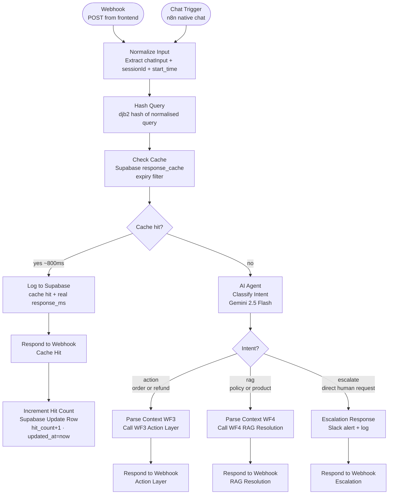

# WF2 — Triage

**Role:** Single entry point for all chat-channel traffic. Accepts both Webhook (POST from frontend) and Chat Trigger (native n8n chat). Normalises input, checks the response cache, classifies intent via Gemini on cache miss, and routes to the correct downstream workflow.

---

---

## Node summary

| Node | Type | Purpose |
|---|---|---|
| Webhook | Trigger | Receives POST from frontend VoltBot widget |
| When chat message received | Chat Trigger | Native n8n chat interface trigger |
| Normalize Input | Code | Extracts `chatInput`, `sessionId`, `start_time` — trigger-agnostic output |
| Hash Query | Code | djb2 hash over lowercased, whitespace-collapsed query → 8-char hex digest |
| Check Cache | HTTP Request | GET from `response_cache` where `query_hash=eq.X AND expires_at=gt.now()` |
| Cache Hit | IF | Branches on non-empty `response` field |
| Log to Supabase1 | HTTP Request | Logs cache hit ticket with real `response_ms` to WF7 log-ticket webhook |
| Respond to Webhook — Cache Hit | Respond to Webhook | Returns cached response immediately |
| Increment Hit Count | Supabase Update a Row | Updates `hit_count + 1` and `updated_at = now()` on matching `response_cache` row |
| AI Agent (Classify Intent) | AI Agent | Gemini 2.5 Flash — classifies into `escalate`, `action`, or `rag` |
| Parse Context WF3 | Set | Prepares ticket_id, message, intent, sentiment, urgency for WF3 |
| Parse Context WF4 | Set | Prepares ticket context + `queryHash` + `normalizedQuery` for WF4 cache write |
| Call WF3 — Action Layer | Execute Workflow | Sub-workflow call — synchronous, waits for response |
| Call WF4 — RAG Resolution | Execute Workflow | Sub-workflow call — synchronous, waits for response |
| Escalation Response | Set | Hardcoded escalation acknowledgement message |
| Set Ticket ID | Set | Generates epoch ms ticket ID for escalation path |
| Send to Slack | HTTP Request | Posts Block Kit escalation message to #support-escalations |
| Log to Supabase (escalation) | HTTP Request | Logs escalation ticket via WF7 log-ticket webhook |
| Respond to Webhook (×3) | Respond to Webhook | One per exit path — action, RAG, escalation |

## Key design decisions

- **Dual trigger normalisation** — Normalize Input runs on both Webhook and Chat Trigger paths and produces identical `{chatInput, sessionId, start_time}` — all downstream nodes are trigger-agnostic and reference `Normalize Input` not the trigger node
- **Cache before classification** — Hash Query and Check Cache run before Gemini is called. A warm cache hit never touches the LLM — responds in ~800ms
- **Cache hit logging uses real elapsed time** — `response_ms` is computed from `start_time` captured in Normalize Input, not hardcoded
- **Increment Hit Count uses native Supabase node** — HTTP Request PATCH to Supabase silently fails without surfacing errors; native Supabase Update a Row node handles auth and surfaces errors correctly. Also updates `updated_at` timestamp on each hit
- **queryHash and normalizedQuery passed to WF4** — WF4 uses these to write the cache entry after a grounded RAG response, closing the cache warm-up loop
- **Three separate Respond to Webhook nodes** — one per exit path — prevents response bleed between routes
- **Intent classifier includes explicit rules** — stolen/lost package queries are always `complaint` with `requires_action=false` (routes to RAG, not WF3); delivery address questions are always `product_question` with `requires_action=false`
- **Log to Supabase1 placed before Respond to Webhook** — node references to Normalize Input and Check Cache go out of scope after Respond to Webhook fires; logging must occur before the response node
