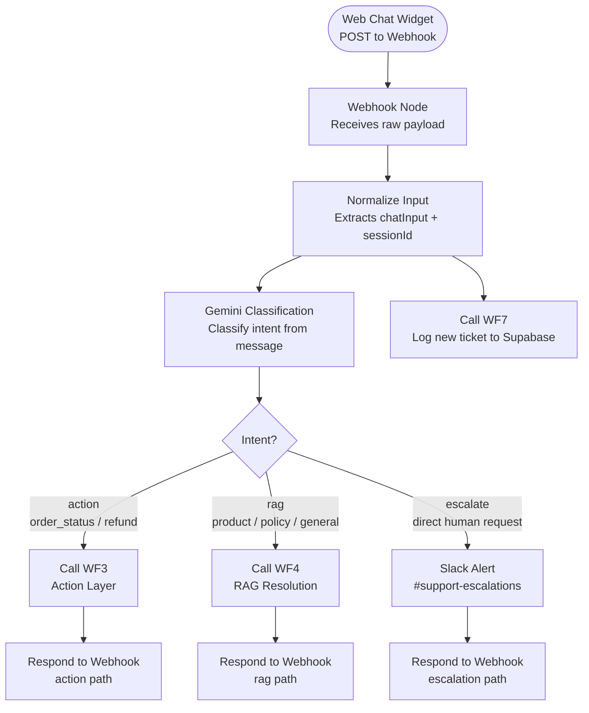

# WF2 — Triage

**Role:** Single web chat entry point. Receives all frontend messages, normalizes input, classifies intent via Gemini, and routes to the correct downstream workflow.

---

---

## Node summary

| Node | Type | Purpose |
|---|---|---|
| Webhook | Trigger | Receives POST from frontend widget |
| Normalize Input | Code | Extracts `chatInput` and `sessionId` from raw body |
| Gemini Classification | AI Agent | Classifies intent into `action`, `rag`, or `escalate` |
| Call WF3 | HTTP Request | Triggers Action Layer for transactional intents |
| Call WF4 | HTTP Request | Triggers RAG Resolution for knowledge intents |
| Slack Alert | Slack | Posts escalation message to #support-escalations |
| Respond to Webhook (×3) | Respond to Webhook | One per exit path — returns response to frontend |
| Call WF7 | HTTP Request | Logs ticket to Supabase support_logs |

## Key design decisions

- Normalize Input runs **before** classification — ensures Gemini always receives clean `chatInput`, not raw webhook body
- Three separate Respond to Webhook nodes — one per exit path — prevents response bleed between routes
- WF7 logging is triggered from WF2 so every ticket gets a DB record regardless of downstream route
- Classification prompt strictly enforces `action` only for explicit transactional requests (order number or refund keyword present)
