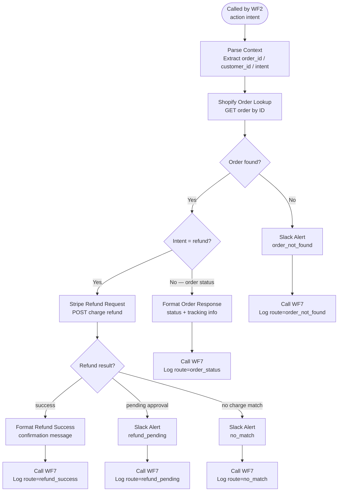

# WF3 — Action Layer

**Role:** Handles all transactional intents. Looks up orders via Shopify and processes refunds via Stripe. Produces 4 distinct routes depending on order and refund state.

---

---

## Node summary

| Node | Type | Purpose |
|---|---|---|
| Parse Context | Edit Fields | Extracts `order_id`, `customer_id`, `intent` from WF2 payload |
| Shopify Order Lookup | HTTP Request | GET order from Shopify Admin API |
| Stripe Refund Request | HTTP Request | POST refund against Stripe charge — limit=100 with customer filter |
| Slack Alert (×3) | Slack | Alerts for `refund_pending`, `no_match`, `order_not_found` |
| Call WF7 (×5) | HTTP Request | Logs each route outcome to Supabase with `route` field |

## Routes

| Route | Trigger | Slack? |
|---|---|---|
| `refund_success` | Stripe refund confirmed | No |
| `refund_pending` | Refund requires manual approval | Yes |
| `no_match` | No charge found for order | Yes |
| `order_not_found` | Shopify returns no order | Yes |
| `order_status` | Intent was status check, not refund | No |

## Key design decisions

- Stripe query uses `limit=100` with customer filter to avoid pagination gaps on older orders
- WF3 only fires for **explicit** transactional intents — classification prompt enforces this upstream in WF2
- All 5 route exits log independently to WF7 with the `route` field set — enables per-route analytics in Supabase
