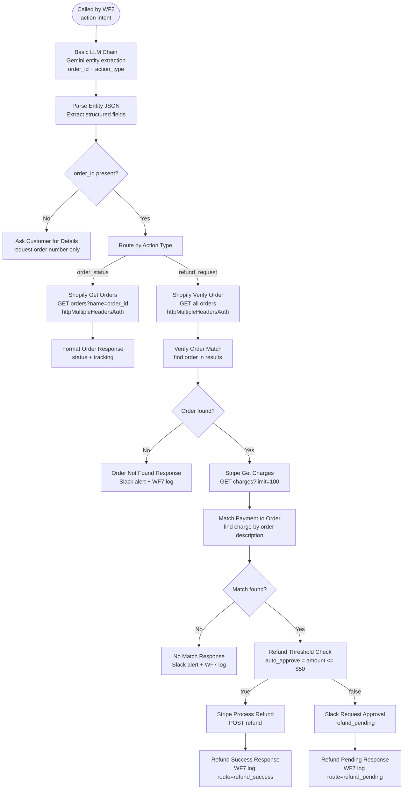

# WF3 — Action Layer

**Role:** Handles all transactional intents. Looks up orders via Shopify and processes refunds via Stripe. Produces 4 distinct routes depending on order and refund state.

---

---

## Node summary

| Node | Type | Purpose |
|---|---|---|
| When Executed by Another Workflow | Execute Workflow Trigger | Receives context from WF2 |
| Basic LLM Chain | LLM Chain | Gemini extracts `order_id` and `action_type` from message |
| Parse Entity JSON | Code | Parses Gemini JSON output, merges with WF2 context |
| Check Missing Entities | IF | Blocks only on missing `order_id` — email gate removed; uses `does not exist` operator to catch both null and undefined |
| Ask Customer for Details | Set | Returns prompt asking for order number only — "Please provide your order number so I can look into this for you." |
| Route by Action Type | Switch | Routes on `action_type`: `order_status` or `refund_request` |
| Shopify Get Orders | HTTP Request | GET with `name` query param — uses `httpMultipleHeadersAuth` (X-Shopify-Access-Token) |
| Shopify Verify Order | HTTP Request | GET all orders — uses `httpMultipleHeadersAuth` (X-Shopify-Access-Token) |
| Format Order Response | Code | Formats order status with fulfillment and tracking info |
| Verify Order Match | Code | Finds order in Shopify results by order number |
| Order Exists Check | IF | Branches on `order_found` flag |
| Stripe Get Charges | HTTP Request | GET charges with `limit=100` and customer filter |
| Match Payment to Order | Code | Matches charge to order by description |
| Check Match Found | IF | Branches on non-null `charge_id` |
| Refund Threshold Check | IF | `auto_approve = amount <= 5000` (cents = $50) |
| Stripe Process Refund | HTTP Request | POST refund against matched charge |
| Slack — Request Approval | HTTP Request | Block Kit message for refund_pending — `Authorization: Bearer xoxb-...` header |
| Slack — No Match Alert | HTTP Request | Block Kit message for no_match — `Authorization: Bearer xoxb-...` header |
| Slack — Order Not Found Alert | HTTP Request | Block Kit message for order_not_found — `Authorization: Bearer xoxb-...` header |
| WF7 log nodes (×4) | HTTP Request | One per route exit — refund_success, refund_pending, no_match, order_not_found — sets `source: wf3` and `route` field |

## Routes

| Route | Trigger | Slack? | escalated | resolved |
|---|---|---|---|---|
| `refund_success` | Stripe refund confirmed, amount ≤ $50 | No | false | true |
| `refund_pending` | Refund amount > $50, requires approval | Yes | true | false |
| `no_match` | No Stripe charge found for order | Yes | true | false |
| `order_not_found` | Shopify returns no matching order | Yes | true | false |

## Key design decisions

- **Shopify uses httpMultipleHeadersAuth** — n8n's native Shopify credential type was incompatible with the Railway deployment. Shopify nodes use HTTP Request with `X-Shopify-Access-Token` header via the Multiple Headers Auth credential
- **Check Missing Entities blocks on order_id only** — email was originally required but removed; it caused unnecessary friction on order queries where only order_id is needed for Shopify lookup. Uses `does not exist` operator (not `is empty`) to catch null and undefined
- **Ask Customer for Details requests order number only** — prompt updated to remove email requirement after email gate was removed
- **Stripe query uses limit=100 with customer filter** — avoids pagination gaps on accounts with many charges
- **Refund threshold is $50** — orders above this require manual Slack approval; below auto-process via Stripe API
- **All 4 exit paths log to WF7** with `source: wf3` and `route` field set — enables per-route analytics in the dashboard and correctly separates transactional tickets from RAG tickets
- **All 3 Slack nodes use Authorization header** — `Authorization: Bearer xoxb-...` hardcoded in Send Headers — not using n8n Generic Auth which was failing silently with `not_authed`
- **`onError: continueRegularOutput`** on all 4 log nodes — logging failures never block the customer-facing response
