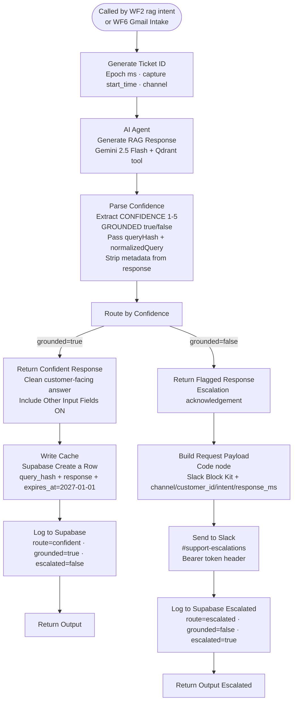

# WF4 — RAG Resolution

**Role:** Knowledge-grounded answer generation. Searches Qdrant for relevant KB chunks, generates an answer via Gemini, parses confidence and grounding metadata, writes to cache on grounded responses, logs all tickets to WF7, and escalates to Slack on ungrounded responses. Also serves as the resolution engine for Gmail (called directly by WF6).

---

---

## Node summary

| Node | Type | Purpose |
|---|---|---|
| When Executed by Another Workflow | Execute Workflow Trigger | Receives context from WF2 or WF6 |
| Generate Ticket ID | Set | Creates epoch ms ticket ID, captures `start_time`, extracts `chatInput`, `channel`, `customer_id` |
| AI Agent (Generate RAG Response) | AI Agent | Gemini 2.5 Flash with Qdrant Vector Store as retrieval tool |
| Google Gemini Chat Model | LM | Gemini 2.5 Flash |
| Qdrant Vector Store | Vector Store | `voltshop_kb` collection, `content` field, 3072-dim cosine, retrieve-as-tool mode |
| Embeddings Google Gemini | Embeddings | Gemini Embedding 001 — attached to Qdrant store |
| Parse Confidence | Code | Regex extracts `CONFIDENCE: [1-5]` and `GROUNDED: [true/false]` from agent output, strips metadata from customer response, passes `queryHash` and `normalizedQuery` to downstream nodes |
| Route by Confidence | Switch | `grounded=true` → output 0, `grounded=false` → output 1 |
| Return Confident Response | Set | Sets `output` field to clean response — Include Other Input Fields enabled to pass queryHash/normalizedQuery to Write Cache |
| Write Cache | Supabase Create a Row | Inserts row into `response_cache` with `query_hash`, `query_text`, `response`, `hit_count=0`, `expires_at=2027-01-01` — native node replaces HTTP Request which silently failed |
| Log to Supabase | HTTP Request | Logs confident ticket to WF7 log-ticket webhook — `route: confident`, `source: wf4`, `escalated: false` |
| Return Output | Set | Final output node for WF2 caller on confident path |
| Build Request Payload | Code | Constructs Slack Block Kit JSON with interactive buttons — enriches payload with `channel`, `customer_id`, `intent`, `route`, `response_ms` from upstream nodes |
| Send to Slack | HTTP Request | Posts to #support-escalations with `ticket_id` as button value — `Authorization: Bearer xoxb-...` header |
| Log to Supabase (Escalated) | HTTP Request | Logs escalated ticket to WF7 log-ticket webhook — `route: escalated`, `source: wf4`, `escalated: true` — references `Build Request Payload` node for all fields |
| Return Output (Escalated) | Set | Final output node for escalated path — references `Build Request Payload.first().json.output` |

## Grounding logic

| State | Meaning | Action |
|---|---|---|
| `grounded=true` | Gemini answer is supported by KB retrieval | Write cache → log (route: confident) → return answer |
| `grounded=false` | No KB match or insufficient confidence | Slack escalation → log (route: escalated) → return fallback |

## Key design decisions

- **WF4 is called by both WF2 and WF6** — Parse Context in WF2 passes `queryHash` and `normalizedQuery` so WF4 can write the cache; WF6 does not pass these (email queries are not cached)
- **Confidence and grounding are parsed from model output** — the AI Agent prompt instructs Gemini to append `CONFIDENCE: [1-5]` and `GROUNDED: [true/false]` at the end of every response; Parse Confidence strips these before returning the customer-facing answer
- **Parse Confidence passes queryHash and normalizedQuery** — added to the return object so these fields survive through Route by Confidence → Return Confident Response → Write Cache
- **Return Confident Response has Include Other Input Fields enabled** — required to pass queryHash and normalizedQuery through to Write Cache; without this they are dropped
- **Write Cache uses native Supabase Create a Row node** — HTTP Request POST to Supabase silently returned empty output with no error on failures (RLS violations, malformed body, auth issues). Native node surfaces errors correctly
- **Cache expires_at is hardcoded to 2027-01-01** — not a rolling TTL. All cache entries share the same expiry date
- **Log to Supabase (Escalated) references Build Request Payload** — positioned after Send to Slack; uses `$('Build Request Payload').first().json.*` expressions to access original data since `$json` at that point contains the Slack API response
- **Build Request Payload enriches the log payload** — adds `channel`, `customer_id`, `intent`, `route: "escalated"`, `response_ms = Date.now() - parseInt(ticket_id)` to the Slack payload and log body
- **Send to Slack uses Authorization header** — `Authorization: Bearer xoxb-...` hardcoded in Send Headers — not using n8n Generic Auth which was failing with `not_authed`
- **AI Agent prompt updated** — instructs Gemini to preserve full KB detail without summarising, and uses accurate CONFIDENCE/GROUNDED scale descriptions based on KB retrieval quality
- **Self-healing loop** — escalated tickets resolved via WF5 upsert new Qdrant points — identical future queries auto-resolve without human intervention
