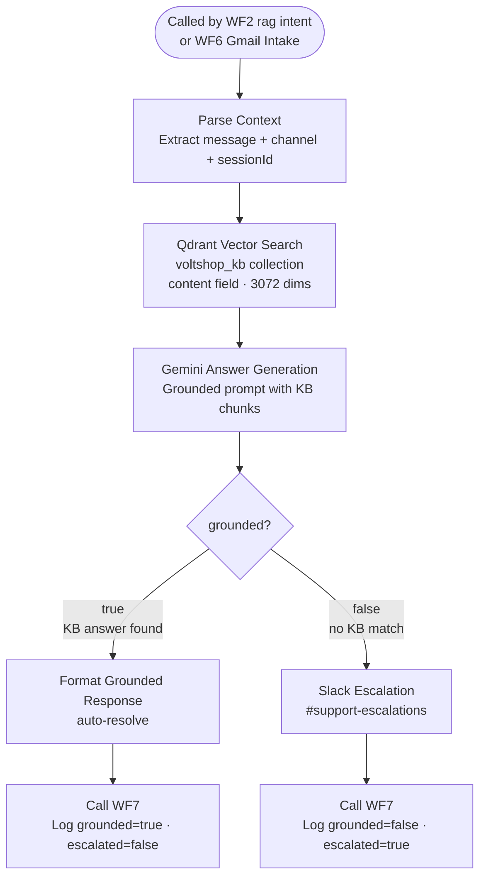

# WF4 — RAG Resolution

**Role:** Knowledge-grounded answer generation. Searches Qdrant for relevant KB chunks, generates an answer via Gemini, and routes based on whether the answer is grounded. Also serves as the resolution engine for Gmail (called directly by WF6).

---

---

## Node summary

| Node | Type | Purpose |
|---|---|---|
| Parse Context | Edit Fields | Extracts `message`, `channel`, `sessionId` — handles both WF2 and WF6 callers |
| Qdrant Vector Search | HTTP Request | Searches `voltshop_kb` collection using `content` field, 3072-dim embeddings |
| Gemini Answer Generation | AI Agent | Generates answer strictly grounded in retrieved KB chunks |
| Slack Escalation | Slack | Posts to #support-escalations when grounded=false |
| Call WF7 (×2) | HTTP Request | Logs outcome with `grounded` and `escalated` flags |

## Grounding logic

| State | Meaning | Action |
|---|---|---|
| `grounded=true` | Gemini answer is supported by KB chunks | Auto-resolve, log, return answer |
| `grounded=false` | No KB match or low confidence | Escalate to Slack, log |

## Key design decisions

- WF4 is called by **both WF2** (via RAG intent) and **WF6** (Gmail always routes here directly)
- Parse Context uses `.first()` for cross-workflow compatibility — avoids `.item` incompatibility when called from WF6
- Qdrant collection: `voltshop_kb`, field: `content`, dimensions: 3072
- Gemini prompt instructs model to return `grounded: false` if chunks are insufficient — prevents hallucinated answers from auto-resolving
- Self-healing loop: escalated tickets can be resolved and added to KB via WF5, which prevents recurrence
