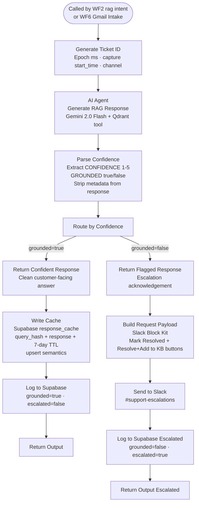

# WF4 — RAG Resolution

**Role:** Knowledge-grounded answer generation. Searches Qdrant for relevant KB chunks, generates an answer via Gemini, parses confidence and grounding metadata, writes to cache on grounded responses, and escalates to Slack on ungrounded responses. Also serves as the resolution engine for Gmail (called directly by WF6).

---

---

## Node summary

| Node | Type | Purpose |
|---|---|---|
| When Executed by Another Workflow | Execute Workflow Trigger | Receives context from WF2 or WF6 |
| Generate Ticket ID | Set | Creates epoch ms ticket ID, captures `start_time`, extracts `chatInput`, `channel`, `customer_id` |
| AI Agent (Generate RAG Response) | AI Agent | Gemini 2.0 Flash with Qdrant Vector Store as retrieval tool |
| Google Gemini Chat Model | LM | Gemini 2.0 Flash — topK=5 |
| Qdrant Vector Store | Vector Store | `voltshop_kb` collection, `content` field, 3072-dim cosine, retrieve-as-tool mode |
| Embeddings Google Gemini | Embeddings | Gemini Embedding 001 — attached to Qdrant store |
| Parse Confidence | Code | Regex extracts `CONFIDENCE: [1-5]` and `GROUNDED: [true/false]` from agent output, strips metadata from customer response |
| Route by Confidence | Switch | `grounded=true` → output 0, `grounded=false` → output 1 |
| Return Confident Response | Set | Sets `output` field to clean response |
| Write Cache | HTTP Request | POST to `response_cache` with `query_hash`, `query_text`, `response`, `expires_at` (7-day TTL) — upsert via `Prefer: resolution=merge-duplicates` |
| Log to Supabase | HTTP Request | Logs grounded ticket to WF7 log-ticket webhook |
| Return Output | Set | Final output node for WF2 caller |
| Build Request Payload | Code | Constructs Slack Block Kit JSON with interactive buttons |
| Send to Slack | HTTP Request | Posts to #support-escalations with `ticket_id` as button value |
| Log to Supabase (Escalated) | HTTP Request | Logs ungrounded ticket to WF7 log-ticket webhook |
| Return Output (Escalated) | Set | Final output node for escalated path |

## Grounding logic

| State | Meaning | Action |
|---|---|---|
| `grounded=true` | Gemini answer is supported by KB retrieval | Write cache → log → return answer |
| `grounded=false` | No KB match or insufficient confidence | Slack escalation → log → return fallback |

## Key design decisions

- **WF4 is called by both WF2 and WF6** — Parse Context in WF2 passes `queryHash` and `normalizedQuery` so WF4 can write the cache; WF6 does not pass these (email is not cached)
- **Confidence and grounding are parsed from model output** — the system prompt instructs Gemini to append `CONFIDENCE: [1-5]` and `GROUNDED: [true/false]` at the end of every response; Parse Confidence strips these before returning the customer-facing answer
- **Cache write uses upsert semantics** — `Prefer: resolution=merge-duplicates` handles the duplicate key constraint that occurs when the same query fires concurrently during cache warm-up
- **Cache TTL is 7 days** — no active invalidation; KB updates via WF5 take effect for new queries immediately but cached responses remain stale for up to 7 days
- **Qdrant collection:** `voltshop_kb`, field: `content`, dimensions: 3072, distance: cosine
- **Self-healing loop:** escalated tickets resolved via WF5 upsert new Qdrant points — identical future queries auto-resolve without human intervention
