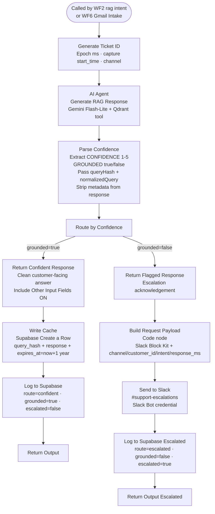

# WF4 — RAG Resolution

**Role:** Knowledge-grounded answer generation. Searches Qdrant for relevant KB chunks, generates an answer via Gemini, parses confidence and grounding metadata, writes to cache on grounded responses, logs all tickets to WF7, and escalates to Slack on ungrounded responses. Also serves as the resolution engine for Gmail (called directly by WF6).

---

## Summary

Gemini powered RAG agent with Qdrant as a retrieval tool. AI Agent queries Qdrant `voltshop_kb`, appends `CONFIDENCE: [1-5]` and `GROUNDED: [true/false]` metadata. Parse Confidence Code node extracts both values and passes `queryHash` + `normalizedQuery` through to downstream nodes. Grounded responses are written to `response_cache` with a plain insert (native Supabase node), expiring one year after the write. If the `query_hash` already exists — for example two identical questions at the same moment — the insert fails on the unique constraint, but Write Cache is set to On Error → Continue, so the customer's answer and the WF7 log call are unaffected. Expired rows are deleted nightly by a Supabase `pg_cron` job, so an expired entry is removed within a day; until then a failed write is harmless (On Error → Continue). Ungrounded responses build a Slack Block Kit payload with Mark Resolved and Resolve + Add to KB interactive buttons carrying the `ticket_id` as the action value. AI Agent prompt instructs Gemini to preserve full KB detail without summarising.

---

```mermaid
flowchart TD
    A([Called by WF2 rag intent\nor WF6 Gmail Intake]) --> B[Generate Ticket ID\nEpoch ms · capture start_time · channel]
    B --> C[AI Agent\nGenerate RAG Response\nGemini Flash-Lite + Qdrant tool]
    C --> D[Parse Confidence\nExtract CONFIDENCE 1-5\nGROUNDED true/false\nPass queryHash + normalizedQuery\nStrip metadata from response]
    D --> E[Route by Confidence]

    E -->|grounded=true| F[Return Confident Response\nClean customer-facing answer\nInclude Other Input Fields ON]
    E -->|grounded=false| G[Return Flagged Response\nEscalation acknowledgement]

    F --> H[Write Cache\nSupabase Create a Row\nquery_hash + response + expires_at=now+1 year]
    H --> I[Log to Supabase\nroute=confident · grounded=true · escalated=false]
    I --> J[Return Output]

    G --> K[Build Request Payload\nCode node\nSlack Block Kit + channel/customer_id/intent/response_ms]
    K --> L[Send to Slack\n#support-escalations\nSlack Bot credential]
    L --> M[Log to Supabase Escalated\nroute=escalated · grounded=false · escalated=true]
    M --> N[Return Output Escalated]
```

---

## Node summary

| Node | Type | Purpose |
|---|---|---|
| When Executed by Another Workflow | Execute Workflow Trigger | Receives context from WF2 or WF6 |
| Generate Ticket ID | Set | Creates epoch ms ticket ID, captures `start_time`, extracts `chatInput`, `channel`, `customer_id` |
| AI Agent (Generate RAG Response) | AI Agent | Gemini Flash-Lite with Qdrant Vector Store as retrieval tool |
| Google Gemini Chat Model | LM | `models/gemini-flash-lite-latest`, temperature 0, topK 5 |
| Qdrant Vector Store | Vector Store | `voltshop_kb` collection, `content` field, 3072-dim cosine, retrieve-as-tool mode |
| Embeddings Google Gemini | Embeddings | Gemini Embedding 001 — attached to Qdrant store |
| Parse Confidence | Code | Regex extracts `CONFIDENCE: [1-5]` and `GROUNDED: [true/false]` from agent output, strips metadata from customer response, passes `queryHash` and `normalizedQuery` to downstream nodes |
| Route by Confidence | Switch | `grounded=true` → output 0, `grounded=false` → output 1 |
| Return Confident Response | Set | Sets `output` field to clean response — Include Other Input Fields enabled to pass queryHash/normalizedQuery to Write Cache |
| Write Cache | Supabase Create a Row | Inserts row into `response_cache` with `query_hash`, `query_text`, `response`, `hit_count=0`, `expires_at=now + 1 year` — plain insert, On Error → Continue — native node replaces HTTP Request which silently failed |
| Log to Supabase | HTTP Request | Logs confident ticket to WF7 log-ticket webhook — `route: confident`, `source: wf4`, `escalated: false` |
| Return Output | Set | Final output node for WF2 caller on confident path |
| Build Request Payload | Code | Constructs Slack Block Kit JSON with interactive buttons — enriches payload with `channel`, `customer_id`, `intent`, `route`, `response_ms` from upstream nodes |
| Send to Slack | HTTP Request | Posts to #support-escalations with `ticket_id` as button value — `Slack Bot` credential |
| Log to Supabase (Escalated) | HTTP Request | Logs escalated ticket to WF7 log-ticket webhook — `route: escalated`, `source: wf4`, `escalated: true` — references `Build Request Payload` node for all fields |
| Return Output (Escalated) | Set | Final output node for escalated path — references `Build Request Payload.first().json.output` |

## Grounding logic

| State | Meaning | Action |
|---|---|---|
| `grounded=true` | Gemini answer is supported by KB retrieval | Write cache → log (route: confident) → return answer |
| `grounded=false` | No KB match or insufficient confidence | Slack escalation → log (route: escalated) → return fallback |

## Key design decisions

- **WF4 is called by both WF2 and WF6** — Parse Context in WF2 passes `queryHash` and `normalizedQuery` so WF4 can write the cache; WF6 does not pass these (email queries are not cached)
- **Confidence and grounding are parsed from model output** — the AI Agent prompt instructs Gemini to append `CONFIDENCE: [1-5]` and `GROUNDED: [true/false]` at the end of every response; Parse Confidence strips these before returning the customer-facing answer
- **Parse Confidence passes queryHash and normalizedQuery** — added to the return object so these fields survive through Route by Confidence → Return Confident Response → Write Cache
- **Return Confident Response has Include Other Input Fields enabled** — required to pass queryHash and normalizedQuery through to Write Cache; without this they are dropped
- **A failed cache write never breaks the answer** — Write Cache is a plain insert; a duplicate `query_hash` fails on the unique constraint `response_cache_query_hash_key`. Write Cache is set to On Error → Continue (regular output), and Log to Supabase reads only from earlier named nodes, so the customer's answer and the WF7 log still go through. Expired rows are deleted nightly by a Supabase `pg_cron` job (03:00 UTC), so an expired entry cannot block a fresh write
- **Write Cache uses native Supabase Create a Row node** — HTTP Request POST to Supabase silently returned empty output with no error on failures (RLS violations, malformed body, auth issues). Native node surfaces errors correctly
- **Cache entries expire one year after they are written** — `expires_at = now + 365 days` (until 2026-10 it was a fixed 2027-01-01, which would have expired every entry at once)
- **Log to Supabase (Escalated) references Build Request Payload** — positioned after Send to Slack; uses `$('Build Request Payload').first().json.*` expressions to access original data since `$json` at that point contains the Slack API response
- **Build Request Payload enriches the log payload** — adds `channel`, `customer_id`, `intent`, `route: "escalated"`, `response_ms = Date.now() - parseInt(ticket_id)` to the Slack payload and log body
- **Send to Slack authenticates through the `Slack Bot` credential** — HTTP Request with the predefined Slack API credential type. Until the Cloud Run migration the bot token was hardcoded in an `Authorization` header, which workflow exports replaced with `REDACTED` and which then broke on deploy; the credential store fixes that
- **AI Agent prompt updated** — instructs Gemini to preserve full KB detail without summarising, and uses accurate CONFIDENCE/GROUNDED scale descriptions based on KB retrieval quality
- **Self-healing loop** — escalated tickets resolved via WF5 upsert new Qdrant points — identical future queries auto-resolve without human intervention
