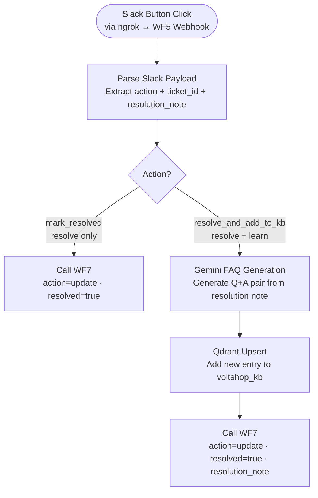

# WF5 — Feedback Loop

**Role:** Self-healing knowledge base. Triggered by Slack button clicks from human agents. Handles two actions: mark a ticket resolved, or resolve it and add the answer to the Qdrant KB so future identical queries auto-resolve.

---

---

## Node summary

| Node | Type | Purpose |
|---|---|---|
| Webhook | Trigger | Receives Slack interactive button payload via ngrok |
| Parse Slack Payload | Code | Extracts `action`, `ticket_id`, `resolution_note` from Slack payload |
| Gemini FAQ Generation | AI Agent | Converts agent's resolution note into a clean Q+A KB entry |
| Qdrant Upsert | HTTP Request | Inserts new FAQ into `voltshop_kb` collection |
| Call WF7 (×2) | HTTP Request | Updates ticket in Supabase — sets `resolved=true`, `action=update` |

## Slack button actions

| Button | Action value | What happens |
|---|---|---|
| Mark Resolved | `mark_resolved` | Ticket closed in Supabase only |
| Resolve + Add to KB | `resolve_and_add_to_kb` | Ticket closed + new KB entry created in Qdrant |

## Key design decisions

- Slack button callbacks travel: **Slack → ngrok → WF5 Webhook** — ngrok URL must be active for this to work
- WF7 is called with `action: "update"` — this triggers the UPDATE route in WF7, not INSERT
- `resolved=true` is NOT used as the WF7 routing condition (bug previously fixed) — `action==="update"` is the correct condition
- Gemini FAQ generation converts free-text agent notes into structured KB entries — maintains KB quality without manual formatting
- This closes the self-healing loop: escalation → human resolution → KB update → future auto-resolve
