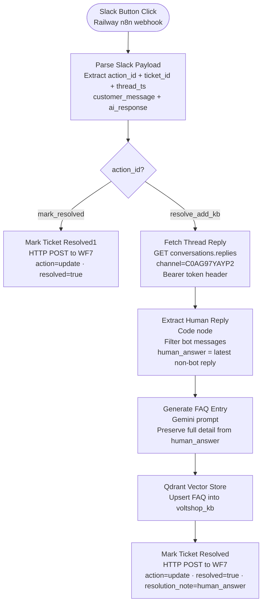

# WF5 — Feedback Loop

**Role:** Self-healing knowledge base. Triggered by Slack button clicks from human agents. Handles two actions: mark a ticket resolved, or resolve it and add the human agent's answer to the Qdrant KB so future identical queries auto-resolve.

---

---

## Node summary

| Node | Type | Purpose |
|---|---|---|
| Webhook | Trigger | Receives Slack interactive button POST — Railway n8n public webhook URL |
| Parse Slack Payload | Code | Extracts `action_id`, `ticket_id` (from button value), `customer_message`, `ai_response`, `thread_ts` from Slack payload |
| Route by Action | Switch | Routes on `action_id`: `mark_resolved` or `resolve_add_kb` |
| Mark Ticket Resolved1 | HTTP Request | POSTs to WF7 log-ticket webhook with `action: "update"`, `resolved: true` — mark_resolved path |
| Fetch Thread Reply | HTTP Request | GET `https://slack.com/api/conversations.replies` with `channel=C0AG97YAYP2` (fixed value) and `ts=$json.thread_ts` — `Authorization: Bearer xoxb-...` hardcoded in Send Headers |
| Extract Human Reply | Code | Filters `messages` array for `!msg.bot_id` — returns `human_answer = latestReply.text`; returns `null` if no human reply found |
| Generate FAQ Entry | AI | Gemini prompt — synthesises clean FAQ entry from `customer_message` + `human_answer`; instructs Gemini to preserve full detail without summarising |
| Qdrant Vector Store | Vector Store | Upserts generated FAQ as new point into `voltshop_kb` collection with Gemini embeddings |
| Mark Ticket Resolved | HTTP Request | POSTs to WF7 log-ticket webhook with `action: "update"`, `resolved: true`, `resolution_note: human_answer` — resolve_add_kb path |

## Slack button actions

| Button | action_id value | What happens |
|---|---|---|
| Mark Resolved | `mark_resolved` | Ticket closed in Supabase only — WF7 UPDATE |
| Resolve + Add to KB | `resolve_add_kb` | Fetch thread reply → Gemini FAQ → Qdrant upsert → WF7 UPDATE |

## Key design decisions

- **Fetch Thread Reply uses hardcoded channel** — `channel` query parameter is fixed to `C0AG97YAYP2`. Using a dynamic expression caused `channel_not_found` errors because `$json.channel_id` was undefined in the Parse Slack Payload output
- **Fetch Thread Reply uses Send Headers for auth** — `Authorization: Bearer xoxb-...` hardcoded directly in Send Headers; Generic Credential Type Header Auth was not sending the token correctly
- **Extract Human Reply guards against empty messages** — `const messages = data.messages || []` prevents crash when Slack thread has no replies
- **Generate FAQ Entry prompt preserves full detail** — instructs Gemini: "preserve all key details, alternatives, and actionable suggestions from the human agent's answer — do not summarise or shorten". Earlier prompt was too concise and Gemini was truncating answers
- **WF7 is called with `action: "update"`** — triggers the UPDATE route in WF7 (PATCH existing row), not INSERT
- **Qdrant upsert uses Gemini Embedding 001** — same embedding model as the KB ingest script — ensures semantic consistency between ingested chunks and WF5-added points
- **This closes the self-healing loop** — escalation → human resolution → KB update → future identical queries auto-resolve at ~800ms from cache
- **WF5 is a webhook-based workflow** — unaffected by Railway container restarts (unlike polling-based triggers)
- **Slack button callbacks reach WF5 via Railway webhook** — in production the WF5 webhook URL is the Railway n8n public URL. No ngrok required in production
