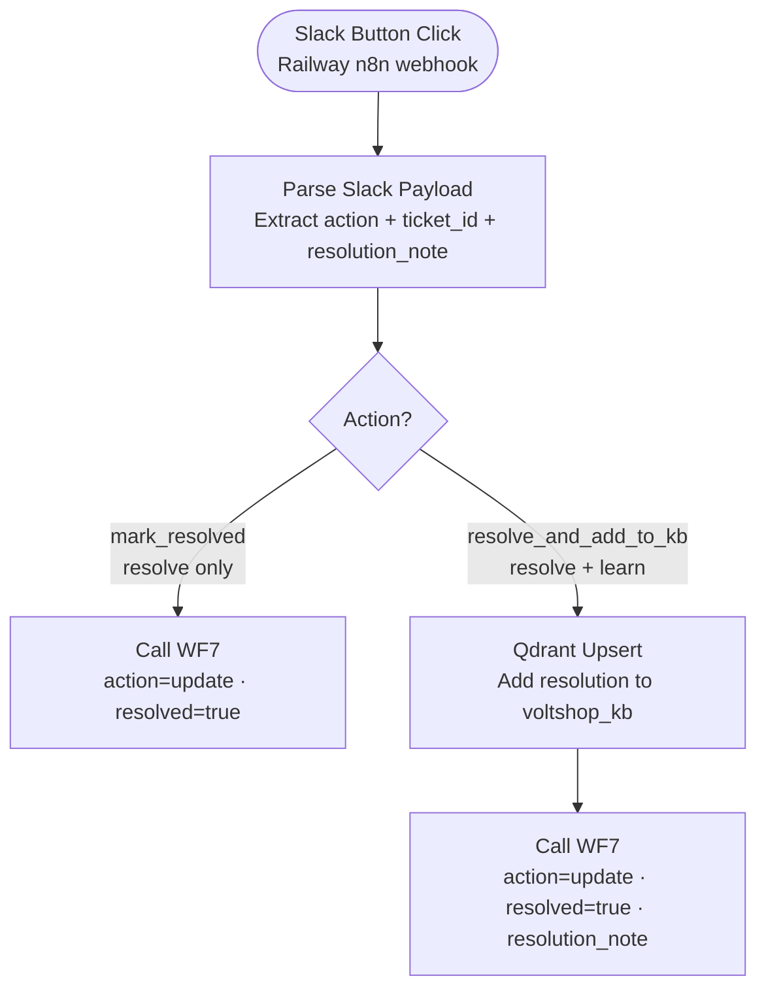

# WF5 — Feedback Loop

**Role:** Self-healing knowledge base. Triggered by Slack button clicks from human agents. Handles two actions: mark a ticket resolved, or resolve it and add the answer to the Qdrant KB so future identical queries auto-resolve.

---

---

## Node summary

| Node | Type | Purpose |
|---|---|---|
| Webhook | Trigger | Receives Slack interactive button POST — Railway n8n public webhook URL |
| Parse Slack Payload | Code | Extracts `action_id`, `ticket_id` (from button value), `resolution_note` from Slack payload |
| Qdrant Upsert | HTTP Request | Inserts resolution as new point into `voltshop_kb` collection |
| Call WF7 — mark resolved | HTTP Request | POSTs to WF7 log-ticket webhook with `action=update`, `resolved=true` |
| Call WF7 — resolve + KB | HTTP Request | POSTs to WF7 log-ticket webhook with `action=update`, `resolved=true`, `resolution_note` |

## Slack button actions

| Button | action_id value | What happens |
|---|---|---|
| Mark Resolved | `mark_resolved` | Ticket closed in Supabase only |
| Resolve + Add to KB | `resolve_add_kb` | Ticket closed + resolution upserted into Qdrant |

## Key design decisions

- **Slack button callbacks reach WF5 via Railway webhook** — in production the WF5 webhook URL is the Railway n8n public URL. During local development ngrok was required; ngrok is not used in production
- **WF7 is called with `action: "update"`** — triggers the UPDATE route in WF7 (PATCH existing row), not INSERT
- **Qdrant upsert preserves KB quality** — the resolution note is upserted directly as a new KB point, making the human agent's answer available for future RAG retrieval without a manual ingest cycle
- **This closes the self-healing loop** — escalation → human resolution → KB update → future identical queries auto-resolve at ~800ms from cache
- **WF5 is a webhook-based workflow** — unaffected by Railway free tier idle (unlike WF6 which uses a polling trigger)
