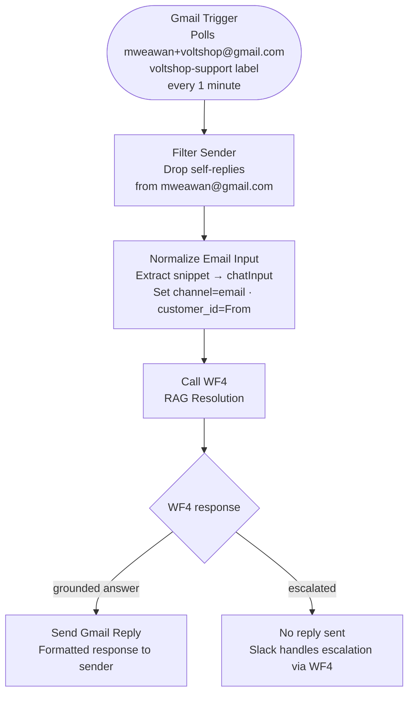

# WF6 — Gmail Intake

**Role:** Email channel adapter. Polls Gmail for new support emails, normalises them into the standard message format, and calls WF4 directly. Email is always a RAG-first flow — WF2 and WF3 are never involved.

---

---

## Node summary

| Node | Type | Purpose |
|---|---|---|
| Gmail Trigger | Gmail Trigger | Polls inbox every minute — filters by `voltshop-support` label ID |
| Filter Sender | IF | Drops emails where `From` contains `mweawan@gmail.com` — prevents reply-to-self loop |
| Normalize Email Input | Set | Maps `snippet` → `chatInput`, sets `channel=email`, sets `customer_id` from `From` header |
| Call WF4 — RAG Resolution | Execute Workflow | Calls WF4 sub-workflow — passes `chatInput`, `channel`, `customer_id` |
| Send Gmail Reply | Gmail | Sends formatted reply to original sender — uses WF4 `output` field |

## Key design decisions

- **WF6 bypasses WF2 entirely** — email is always RAG-first, never classified by the Triage intent classifier. Transactional email intents (order status, refund) are not supported via email channel
- **Filter Sender drops self-replies** — when WF6 sends a reply, Gmail triggers again on the sent message. The Filter Sender IF node checks the `From` address and drops any email from the system account, breaking the loop
- **Gmail account:** `mweawan+voltshop@gmail.com`, label filter: `voltshop-support` — label must be manually applied to incoming emails or set via Gmail filter rules
- **WF7 logging is handled inside WF4** — WF6 does not call WF7 directly; logging occurs within WF4 with `channel=email`
- **If WF4 escalates (grounded=false)** no email reply is sent — the Slack alert from WF4 handles human escalation. Sending an unhelpful auto-reply to the customer is avoided
- **Known limitation:** WF6 uses a polling trigger which stops when Railway free tier idles the container. Webhook-based workflows (WF2, WF3, WF4, WF5, WF7) are unaffected. Resolution: Railway always-on paid tier or Google Cloud Pub/Sub push notifications
