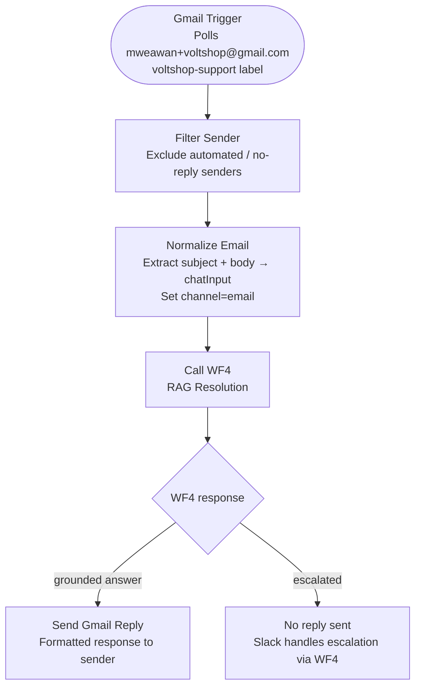

# WF6 — Gmail Intake

**Role:** Email channel adapter. Polls Gmail for new support emails, normalizes them into the standard message format, and calls WF4 directly. Email is always a RAG-first flow — WF2 and WF3 are never involved.

---

---

## Node summary

| Node | Type | Purpose |
|---|---|---|
| Gmail Trigger | Gmail API | Polls inbox — filters by `voltshop-support` label |
| Filter Sender | IF | Drops automated senders, no-reply addresses |
| Normalize Email | Code | Combines subject + body into `chatInput`, sets `channel=email` |
| Call WF4 | HTTP Request | Calls RAG Resolution webhook — uses `.first()` for data access |
| Send Gmail Reply | Gmail API | Sends formatted reply to original sender's email |

## Key design decisions

- WF6 **bypasses WF2 entirely** — email is always RAG-first, never classified by the Triage intent classifier
- WF6 calls WF4 directly using HTTP Request — this required `.first()` instead of `.item` to avoid cross-workflow data access errors
- Gmail account: `mweawan+voltshop@gmail.com`, label filter: `voltshop-support`
- If WF4 escalates (grounded=false), no email reply is sent — the Slack alert from WF4 handles it. This avoids sending an unhelpful auto-reply to the customer
- WF7 logging is handled inside WF4, not WF6 — WF6 does not call WF7 directly
