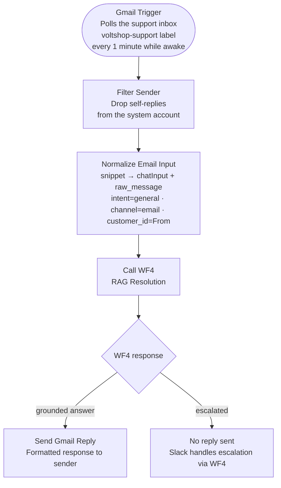

# WF6 — Gmail Intake

**Role:** Email channel adapter. Polls Gmail for new support emails, normalises them into the standard message format, and calls WF4 directly. Email is always a RAG-first flow — WF2 and WF3 are never involved.

---

```mermaid
flowchart TD
    A([Gmail Trigger\nPolls the support inbox\nvoltshop-support label\nevery 1 minute while awake]) --> B[Filter Sender\nDrop self-replies\nfrom the system account]
    B --> C[Normalize Email Input\nsnippet → chatInput + raw_message\nintent=general · channel=email · customer_id=From]
    C --> D[Call WF4\nRAG Resolution]
    D --> E{WF4 response}

    E -->|grounded answer| F[Send Gmail Reply\nFormatted response to sender]
    E -->|escalated| G[No reply sent\nSlack handles escalation via WF4]
```

---

## Node summary

| Node | Type | Purpose |
|---|---|---|
| Gmail Trigger | Gmail Trigger | Polls inbox every minute — filters by `voltshop-support` label ID |
| Filter Sender | IF | Drops emails whose `From` contains the system Gmail address — prevents reply-to-self loop |
| Normalize Email Input | Set | Maps `snippet` → `chatInput` and `raw_message`, sets `intent=general`, `channel=email`, and `customer_id` from the `From` header |
| Call WF4 — RAG Resolution | Execute Workflow | Calls WF4 sub-workflow — passes `chatInput`, `raw_message`, `intent`, `channel`, `customer_id` |
| Send Gmail Reply | Gmail | Sends formatted reply to original sender — uses WF4 `output` field |

## Key design decisions

- **WF6 bypasses WF2 entirely** — email is always RAG-first, never classified by the Triage intent classifier. Transactional email intents (order status, refund) are not supported via email channel
- **Filter Sender drops self-replies** — when WF6 sends a reply, Gmail triggers again on the sent message. The Filter Sender IF node checks the `From` address and drops any email from the system account, breaking the loop
- **Gmail account:** the project's support inbox (a `+voltshop` address alias), label filter: `voltshop-support` — label must be manually applied to incoming emails or set via Gmail filter rules
- **WF7 logging is handled inside WF4** — WF6 does not call WF7 directly; logging occurs within WF4 with `channel=email`
- **If WF4 escalates (grounded=false)** no email reply is sent — the Slack alert from WF4 handles human escalation. Sending an unhelpful auto-reply to the customer is avoided
- **WF6 uses a polling trigger** — it polls only while the Cloud Run instance is awake; emails that arrive while n8n sleeps are answered at the next wake-up. The poller's state (last check time, recently answered message IDs) is stored in the database, so cold starts and restarts do not re-answer emails. Deactivating and re-activating WF6 does reset it and can re-answer the latest email — CD therefore never toggles activation
- **Normalize Email Input sends `raw_message` and `intent`** — WF4's logging reads `message` and `intent` from these fields (the ones WF2 sends for chat). Without them, email tickets were logged with NULL `message` and `intent`; fixed on 2026-10-01
