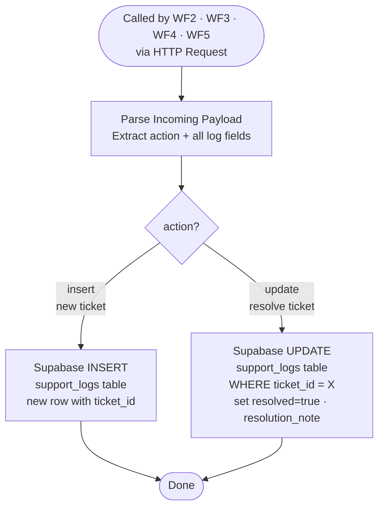

# WF7 — Supabase Logger

**Role:** Sole database writer. All other workflows route through WF7 to write to Supabase — no other workflow touches the DB directly. Handles two operations: INSERT a new ticket, or UPDATE an existing ticket as resolved.

---

---

## Node summary

| Node | Type | Purpose |
|---|---|---|
| Webhook | Trigger | Receives POST from any workflow |
| Parse Incoming Payload | Code | Extracts `action` and all field values from body |
| Route on action | Switch | `action==="insert"` → INSERT · `action==="update"` → UPDATE |
| Supabase INSERT | HTTP Request | Writes new row to `support_logs` |
| Supabase UPDATE | HTTP Request | Updates existing row by `ticket_id` — sets `resolved`, `resolution_note` |

## support_logs schema

| Column | Type | Set by |
|---|---|---|
| `id` | uuid | Supabase auto |
| `created_at` | timestamp | Supabase auto |
| `channel` | text | WF2 / WF6 |
| `customer_id` | text | WF2 / WF3 |
| `message` | text | WF2 / WF6 |
| `intent` | text | WF2 classifier |
| `confidence` | float | WF2 classifier |
| `rag_answer` | text | WF4 |
| `grounded` | boolean | WF4 |
| `escalated` | boolean | WF4 |
| `resolved` | boolean | WF5 via update |
| `resolution_note` | text | WF5 via update |
| `response_ms` | int | WF2 / WF3 / WF4 |
| `ticket_id` | text | WF2 (generated once) |
| `source` | text | `wf3` or `wf4` |
| `route` | text | WF3 route value |

## Key design decisions

- WF7 is the **only** workflow that writes to Supabase — single writer pattern prevents race conditions and duplicate rows
- Routing condition is `action==="update"` — NOT `resolved===true` (previously caused WF5 updates to hit INSERT route — now fixed)
- HTTP Request nodes use **Raw mode with JSON.stringify** — prevents special characters in AI-generated text from breaking the request body
- RLS is disabled on `support_logs` — service role key used for all writes
- All callers (WF2, WF3, WF4, WF5) pass `action: "insert"` or `action: "update"` explicitly in their payloads
