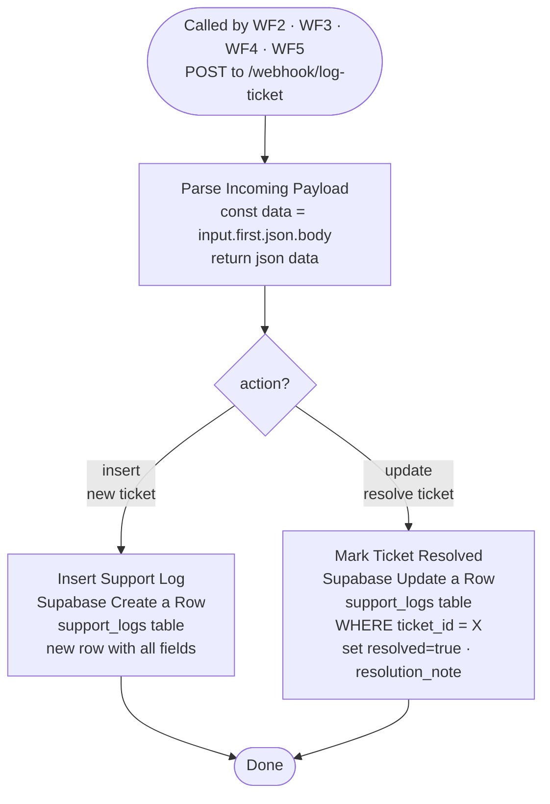

# WF7 — Supabase Logger

**Role:** Sole database writer. All other workflows route through WF7 to write to Supabase — no other workflow touches the DB directly. Handles two operations: INSERT a new ticket, or UPDATE an existing ticket as resolved. Retry on fail (3 attempts, 1s wait) handles free tier connection pool exhaustion under concurrent load.

---

---

## Node summary

| Node | Type | Purpose |
|---|---|---|
| Webhook | Trigger | Receives POST from any upstream workflow at `/webhook/log-ticket` |
| Parse Incoming Payload | Code | `const data = $input.first().json.body; return [{json: data}];` — unwraps body from webhook input |
| Route: Update or Insert | Switch | Routes on `action === "update"` — update path; else insert path |
| Insert Support Log | Supabase Create a Row | Writes new row to `support_logs` — all 16 fields mapped as `{{ $json.fieldName }}` expressions — retry on fail: 3 attempts, 1s wait |
| Mark Ticket Resolved | Supabase Update a Row | Updates existing row matched on `ticket_id` — sets `resolved`, `resolution_note` — retry on fail: 3 attempts, 1s wait |

## support_logs schema

| Column | Type | Set by |
|---|---|---|
| `id` | uuid | Supabase auto |
| `created_at` | timestamptz | Supabase auto |
| `ticket_id` | text | WF2 (generated once, passed to all workflows) |
| `channel` | text | WF2 / WF6 — `'chat'` or `'email'` |
| `customer_id` | text | WF2 sessionId / WF6 From header |
| `message` | text | Raw customer message |
| `intent` | text | WF2 Gemini classifier output |
| `confidence` | integer | WF4 RAG confidence score (1-5) |
| `rag_answer` | text | Final response sent to customer |
| `grounded` | boolean | WF4 grounding flag |
| `escalated` | boolean | WF4/WF3 escalation flag |
| `resolved` | boolean | Updated by WF5 via UPDATE route |
| `resolution_note` | text | WF5 agent resolution note |
| `response_ms` | integer | End-to-end latency from `start_time` in Normalize Input |
| `source` | text | `'wf2'` (cache hit) / `'wf3'` (action) / `'wf4'` (RAG) |
| `route` | text | Granular route: `cache_hit`, `confident`, `escalated`, `refund_success`, `refund_pending`, `no_match`, `order_not_found` |

## Key design decisions

- **Single writer pattern** — WF7 is the only workflow that writes to Supabase. This prevents race conditions, duplicate rows, and simplifies RLS policy management
- **Native Supabase nodes replace HTTP Request** — HTTP Request PATCH/INSERT to Supabase silently returned empty output with no error on failures (RLS violations, malformed body, auth issues). Native Supabase Create a Row and Update a Row nodes surface errors correctly
- **All field mappings use `{{ $json.fieldName }}` expressions** — no hardcoded values. `source`, `route`, `resolved`, `resolution_note` are all dynamic so the correct value from the calling workflow is stored
- **Routing condition is `action === "update"`** — NOT `resolved === true`. Using `resolved` as the routing condition caused WF5 updates to hit the INSERT route — now fixed
- **Parse Incoming Payload extracts from `.body`** — Webhook node wraps the POST body inside a `body` key. Code node unwraps it: `const data = $input.first().json.body; return [{json: data}];`
- **Retry on fail enabled** — 3 attempts with 1s wait on both Insert and Update nodes. Handles transient Supabase connection pool exhaustion under concurrent load without breaking the customer-facing response path
- **`onError: continueRegularOutput`** — logging failures do not propagate back to the caller workflow. The customer-facing response is returned regardless of whether the log write succeeds
- **RLS is enabled** on `support_logs` with a permissive `ALL` policy — anon key used for dashboard reads, service role key used for WF7 writes
- **Note:** Any new table created in this Supabase project will have RLS auto-enabled and will require `ALTER TABLE <name> DISABLE ROW LEVEL SECURITY` before n8n can write to it
