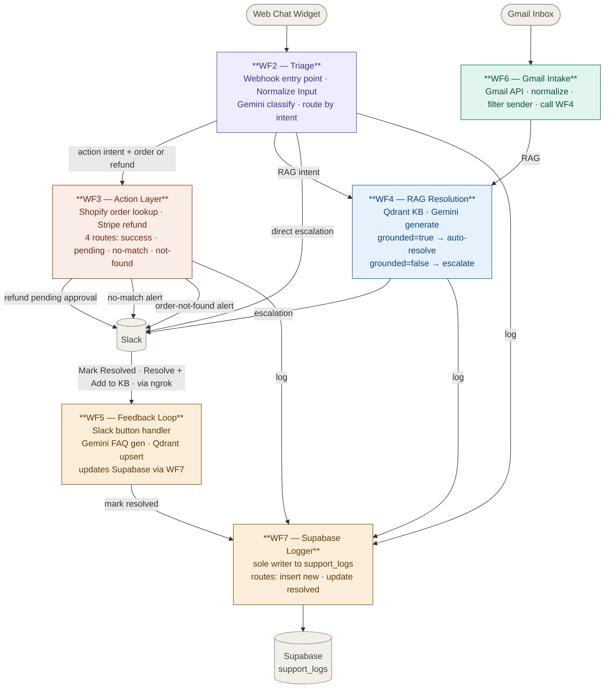

## VoltShop CX Agent — System Architecture

### Channel flow summary

| Entry point | How it enters | Triage | Resolution |
|---|---|---|---|
| Web chat widget | POST to WF2 Webhook → Normalize Input | WF2 | WF3 (action) or WF4 (RAG) |
| Gmail inbox | WF6 polls Gmail → normalizes → calls WF4 | — | WF4 direct |

### Workflow responsibilities

| Workflow | Role | Key integrations |
|---|---|---|
| WF2 — Triage | Webhook entry point · normalize input · classify intent · route | Gemini, Slack |
| WF3 — Action Layer | Shopify order lookup · Stripe refund processing · 4 routes | Shopify, Stripe, Slack |
| WF4 — RAG Resolution | KB-grounded answers · escalate if ungrounded | Qdrant, Gemini, Slack |
| WF5 — Feedback Loop | Slack button handler · self-healing KB · ticket resolution | Qdrant, Slack, WF7 |
| WF6 — Gmail Intake | Email channel adapter · normalize · call WF4 · send reply | Gmail API |
| WF7 — Supabase Logger | Sole DB writer · INSERT new tickets · UPDATE resolved | Supabase support_logs |

### Key design decisions

- WF2 is the single web chat entry point — Webhook node receives POST from frontend, Normalize Input node extracts chatInput and sessionId before classification
- WF6 bypasses WF2 and calls WF4 directly — email is always a RAG-first flow
- WF3 only fires for explicit transactional intents — classification prompt enforces this
- WF7 is the only workflow that writes to Supabase — all others route through it
- Slack button callbacks travel: Slack → ngrok → WF5 webhook
- All 3 WF2 exit paths (escalation, action, RAG) have dedicated Respond to Webhook nodes
