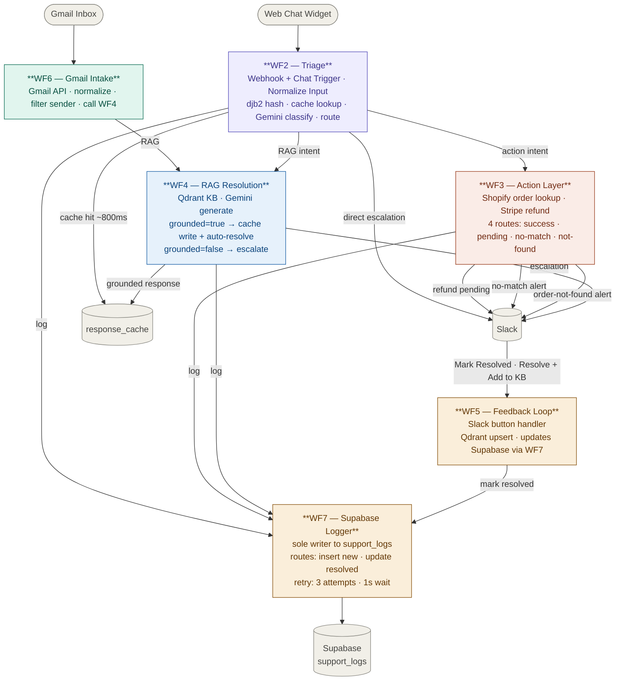

## VoltShop CX Agent — System Architecture

### Channel flow summary

| Entry point | How it enters | Triage | Resolution |
|---|---|---|---|
| Web chat widget | POST to WF2 Webhook → Normalize Input | WF2 | Cache hit (~800ms) or WF3 (action) or WF4 (RAG) |
| Gmail inbox | WF6 polls Gmail → normalizes → calls WF4 | — | WF4 direct |

### Workflow responsibilities

| Workflow | Role | Key integrations |
|---|---|---|
| WF2 — Triage | Dual trigger · normalize · djb2 hash · cache check · classify · route | Gemini, Supabase (cache), Slack |
| WF3 — Action Layer | Shopify order lookup · Stripe refund processing · 4 routes | Shopify, Stripe, Slack |
| WF4 — RAG Resolution | KB-grounded answers · cache write · escalate if ungrounded | Qdrant, Gemini, Supabase (cache), Slack |
| WF5 — Feedback Loop | Slack button handler · self-healing KB · ticket resolution | Qdrant, Slack, WF7 |
| WF6 — Gmail Intake | Email channel adapter · normalize · call WF4 · send reply | Gmail API |
| WF7 — Supabase Logger | Sole DB writer · INSERT new tickets · UPDATE resolved · retry 3× | Supabase support_logs |

### Key design decisions

- WF2 accepts both Webhook (POST body) and Chat Trigger — Normalize Input produces trigger-agnostic `{chatInput, sessionId, start_time}` before classification
- Cache lookup runs before Gemini classification — cache hits bypass the LLM entirely and respond in ~800ms
- WF6 bypasses WF2 and calls WF4 directly — email is always a RAG-first flow
- WF3 only fires for explicit transactional intents — classification prompt enforces this
- WF7 is the only workflow that writes to Supabase — single writer pattern prevents race conditions
- Slack button callbacks travel: Slack → Railway n8n → WF5 webhook (production — no ngrok)
- All 3 WF2 exit paths (escalation, action, RAG) have dedicated Respond to Webhook nodes
